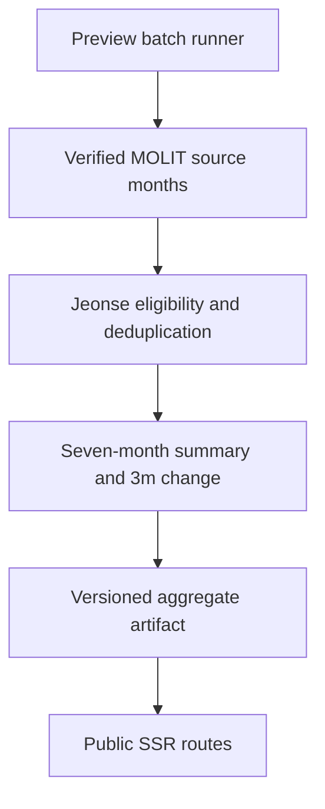

# signedprice Korea Public Summary Generation Design

**Date:** 2026-08-30

**Status:** Approved in chat; written-spec review pending

**Product authority:** `signedprice-build-spec.xlsx`

**Existing public P1 design:**
`docs/superpowers/specs/2026-08-30-signedprice-public-p1-reconciliation-design.md`

## 1. Decision

Complete the missing official-data-to-artifact path for the protected Korea
Public P1 Preview. The public Korea comparison quantity will be refundable
jeonse deposit, matching the workbook. The existing protected Rent Check keeps
its richer deposit-plus-monthly-rent comparison and remains a separate noindex
proof.

The generator will derive one versioned Seoul-wide `45-55sqm` summary from
seven contiguous completed MOLIT months. Only records with positive deposit and
zero monthly rent participate in the public jeonse distribution. Cancelled
records are excluded; active and unknown-status records remain, with their
status mix recorded in the non-served operational job report. Fewer than five eligible records
produces the existing deny-safe withheld shape with no monetary fields.

This design authorizes a protected Preview proof only. It does not authorize
Production, indexing, DNS, redirects, Firewall publication, cache purges, or
KoreaHomeGuide migration.

## 2. Problem being corrected

The current branch has a verified public-summary schema, a Korea aggregation
function, public SSR consumers, and release gates, but no job that loads official
records and emits the environment artifact. The only complete JSON is a
deterministic Playwright fixture, which the release gate correctly forbids in
Vercel.

There is also a semantic mismatch that must be corrected before real data is
introduced: the public input is labelled monthly rent while the existing
summary function calculates monthly rent plus a 5.0% annualized deposit
equivalent. A monthly-rent-only quote therefore cannot be compared with that
distribution. The public Korea metric becomes jeonse deposit; the multi-input
protected tool remains the place for equivalent-cost comparisons.

## 3. Approaches considered

### 3.1 Recommended: reusable generator plus temporary Preview runner

Add a pure, testable generator over verified normalized source months and a
temporary Preview-only runner that fills the existing Vercel Runtime Cache in
bounded batches. The runner never returns raw records, provider URLs, the API
key, or rights evidence. Once every source coordinate is verified, a finalize
operation emits only the aggregate artifact and a non-served operational job
report. The
temporary runner is removed before the final candidate deployment.

This approach reuses the parser, completeness checks, exact-item deduplication,
rights policy, and cache validation already reviewed in `@signedprice/korea-rent`.
It also works within the current 60-second function boundary without making
public page requests depend on MOLIT availability.

### 3.2 Rejected: fetch during `next build`

Build-time collection would make deploy success depend on hundreds of external
requests, complicate retries, and risk incomplete periods being published. It
also gives build logs and environments unnecessary access to source operations.

### 3.3 Rejected: fetch on every public request

Request-time percentile computation violates the workbook's precompute rule,
slows the crawl surface, increases provider load, and makes public availability
depend on live source health. Public routes must read a fixed reviewed artifact
and fail closed when it is absent.

## 4. Public metric and contract

The Korea public config changes to:

- quote label: `Refundable deposit`;
- quote unit: `KRW million`, scaled to whole-won storage before comparison;
- comparison deal: `jeonse`;
- default band for this protected Preview: `45-55sqm`, inclusive of filed
  areas from 45 through 55 square metres;
- fixed axis: KRW 160,000,000 through KRW 620,000,000, matching the workbook's
  16,000–62,000 native 만원 axis;
- registry attribution: MOLIT reported rental contracts.

Changing from monthly-equivalent rent to jeonse deposit is a breaking semantic
change, so the artifact version advances to
`signedprice-public-summary-v2`. Public routes require exactly the Seoul,
`jeonse`, `45-55sqm` identity and refuse v1 artifacts.

The public summary remains the discriminated shape already used by the app:

- `n >= 5`: identity plus `min`, `p25`, `med`, `p75`, `max`, and `chg3m`;
- `n < 5`: identity, `n`, and `published:false` only;
- missing, malformed, incomplete, duplicate, wrong-period, wrong-version, or
  rights-invalid input: no route model and fail-closed 404.

`chg3m` compares the median deposit of the latest three completed months with
the preceding three completed months. If either window has fewer than five
eligible contracts, it is `null`; no partial-window change is published.

## 5. Source coverage and data flow

The source period is the seven calendar months immediately preceding the job
instant. Every coordinate in the following Cartesian product is required:

- 25 verified Seoul district lawd codes;
- apartment, officetel, villa/row-house, and detached/multi-unit sources;
- seven contiguous completed months.

The expected coverage is therefore 700 complete source-month coordinates,
before pagination. The generator will not finalize if any coordinate is absent,
malformed, from another period, or fails cache reconstruction.

The batching cursor is deterministic over district, source type, and month.
Each invocation obeys a fixed provider-call budget, a deadline below the
function limit, bounded concurrency, and existing retry rules. Successfully
validated source months are written through the existing Runtime Cache port so
retries resume instead of refetching completed work.

Generator cache entries use a job-specific, versioned namespace and tag. The
job never purges or mutates the existing protected Rent Check cache cohort.

The finalize step reads only verified complete cache entries, reconstructs
records through the existing manifest/page validation path, filters eligible
jeonse contracts, derives the summary, validates the resulting v2 artifact with
the same parser used by public routes, and then emits it.

## 6. Security and rights boundary

- `DATA_GO_KR_SERVICE_KEY` stays a sensitive, server-only Preview variable.
- The key is never printed, returned, committed, placed in an artifact, or
  prefixed with `NEXT_PUBLIC_`.
- The temporary runner returns categorical progress, coordinate counts, and
  aggregate digests only.
- Raw rows, source pages, provider endpoints, cache contents, and detailed
  rights evidence never cross the server boundary.
- The runner returns 404 outside Vercel Preview and remains behind Vercel
  deployment protection while it exists.
- The runner is deleted before the final candidate deployment; only reusable
  package code, tests, the reviewed aggregate artifact environment values, and
  the non-served operational report remain.
- Rights checks cover fetch, store, cache, derive, display, and commercial
  operations using `kr-molit-rent-v1`.

## 7. Artifact publication and evidence

Finalization produces two distinct outputs:

1. `SIGNEDPRICE_PUBLIC_SUMMARY_ARTIFACT`: the exact compact aggregate JSON;
2. a non-served operational job report containing job ID, generator SHA,
   final candidate SHA, artifact SHA-256,
   generated instant, period, expected/completed coordinate counts, eligible
   record count, status/contract-type mix, parser version, rights policy ID, and
   deployment ID.

`SIGNEDPRICE_PUBLIC_SUMMARY_PERIOD` must exactly equal the artifact period. The
two Preview variables are updated together and require a fresh exact-SHA
deployment. The final deployment must log the categorical `ready` state without
printing either value.

## 8. Error handling and resumability

- Provider timeout/unavailability: mark the current coordinate incomplete and
  return a retryable categorical result; retain earlier verified coordinates.
- Malformed XML, pagination mismatch, overlapping anonymous rows, conflicting
  stable record IDs, or digest mismatch: invalidate the affected source cache
  and stop finalization.
- Rights or provenance failure: stop immediately and emit no artifact.
- Missing completed month: stop finalization even if the remaining sample is
  large.
- Artifact parser failure: emit no environment value and keep public routes
  fail closed.
- A repeated batch request is idempotent and must not duplicate source records
  or change a completed coordinate's digest.

## 9. Testing and release gates

Implementation follows RED → GREEN → review:

1. generator unit tests for seven-month coverage, pure-jeonse filtering,
   cancellations, unknown statuses, exact deduplication, `n=4`, `n=5`, ordered
   percentiles, and `chg3m` window suppression;
2. v2 artifact/schema tests for exact keys, period, provenance, identity,
   duplicate summaries, and v1 refusal;
3. batch-runner tests for Preview-only access, bounded cursor progress,
   idempotent resume, categorical errors, and zero sensitive output;
4. public config/route/component tests proving refundable-deposit copy, the
   fixed axis, initial-server-HTML figures, client-only quote movement, and no
   network requests;
5. package and web lint, typecheck, full unit regression, Next production build,
   client-boundary scan, phase-0 legacy verification, and `git diff --check`;
6. temporary exact-SHA Preview collection and artifact validation;
7. runner-removal commit followed by a fresh final exact-SHA Preview;
8. protected browser verification at 1366×768 and 390×844, including 44px
   targets, visible focus, no overflow, noindex protection, canonical/sitemap
   behavior, and source/key absence from client assets and logs.

## 10. Completion criteria

The work is complete when:

- the exact seven-month source matrix is verified and reproducible;
- the v2 artifact digest and non-served operational report reconcile;
- `/kr/`, `/kr/check/seoul/`, and `/kr/seoul/` render the same jeonse deposit
  distribution for 45–55㎡ contracts in initial HTML on the final protected
  Preview;
- quote edits move only the browser marker and make zero requests;
- withheld and invalid artifacts expose no monetary data and fail closed;
- the temporary runner no longer exists in the final candidate;
- all automated and manual Preview gates pass; and
- no Production, DNS, redirect, indexing, Firewall, or legacy-site mutation has
  occurred.
