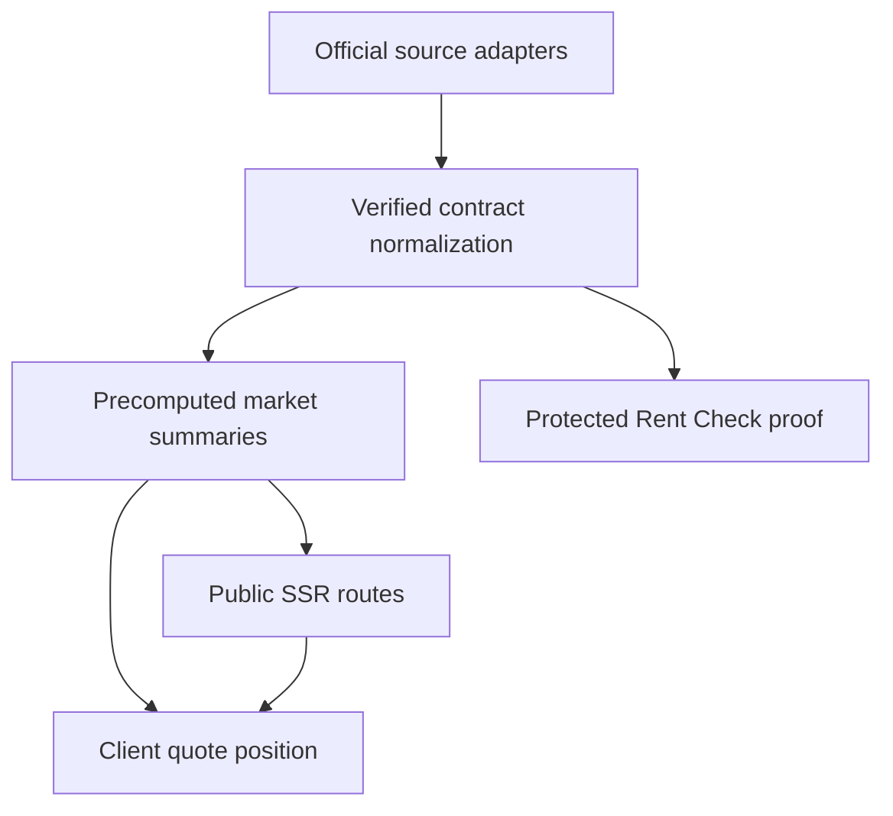

# signedprice Public P1 Reconciliation Design

**Date:** 2026-08-30

**Status:** Approved direction for implementation planning

**Authoritative product reference:** `signedprice-build-spec.xlsx`

**Existing implementation reference:**
`docs/superpowers/specs/2026-08-30-signedprice-seoul-rent-check-design.md`

## 1. Decision

Treat `signedprice-build-spec.xlsx` as the product authority for the public
signedprice P1 experience. Preserve the completed Seoul Rent Check data,
rights, cache, calculation, API, and validation work as an internal noindex
proof slice. Do not describe that slice as the public P1 product and do not
promote it to Production in its current interaction or disclosure shape.

The public P1 is a separate consumer of verified precomputed summaries. It
ships Korea alone at `/kr/`, renders the selected area's published figures in
the initial server HTML, and recalculates the user's marker and verdict from
the five published summary points without a network request.

This decision preserves the expensive official-data foundation without
allowing the existing tool route to redefine the public product contract.

## 2. Why the two specifications cannot be merged literally

The current Rent Check slice and the workbook encode different products:

| Boundary | Current internal slice | Public P1 authority |
| --- | --- | --- |
| Evidence threshold | 3–4 contracts may produce a limited median fallback | Fewer than 5 publishes no median, percentile, range, or marker |
| Primary input flow | District, type, size, deposit, and rent followed by submit | Area and quote only; no submit |
| Recalculation | Same-origin API request | Client-only calculation over SSR summary |
| Primary route | `/kr/seoul/tools/rent-check/` | `/kr/` |
| Market rollout | Korea, Singapore, and Dubai noindex route shells exist | Korea only; Singapore and Dubai return 404 until their feeds exist |
| SEO surface | Whole V2 route family remains noindex | Published Korea area pages become the P1 crawl surface; thin pages remain noindex |

Changing one or two components cannot reconcile these differences. The public
P1 needs its own stable summary contract and route composition while reusing
the verified source and calculation primitives underneath.

## 3. Product authority and exceptions

The workbook's Rules, Routes, DataModel, Screens, Components, MarketConfig,
Tokens, Copy, QA, and BuildOrder sheets are binding for the public P1 unless
this document records an explicit safety or architecture exception.

### 3.1 Public suppression threshold

For every public response and rendered public surface:

- `n >= 5`: the record may publish `min`, `p25`, `med`, `p75`, `max`, and
  derived position copy;
- `n < 5`: the record publishes only identity, `n`, and `published:false`;
- a withheld record never serializes monetary summary fields as `null`, zero,
  or hidden values;
- no consumer may calculate a median or percentile from a withheld record;
- the visible state uses hatching, the exact refusal, and the real count.

The internal Seoul Rent Check proof may retain its 3–4-record research branch
only behind protected noindex Preview access. It is not a public API contract.

### 3.2 Market-config boundary

Shared product components may not branch on Korea, Singapore, or Dubai. Market
labels, units, deal types, geography nouns, registry labels, axes, formatting,
and guide families come from `MarketConfig`.

Market-specific source adapters are the necessary exception: a Korea adapter
may name MOLIT and Korean source fields, a future Singapore adapter may name
URA/HDB, and a future Dubai adapter may name DLD/Ejari. These adapters do not
leak market branches into shared UI or shared summary formatting.

### 3.3 Five-percent wording

Do not publish the workbook's fixed phrase that 5.0% is a statutory conversion
rate. The public product must keep legal rules and signedprice methodology
separate. Any fixed 5.0% used by signedprice is labelled exactly as a
signedprice comparison assumption. A statutory claim requires a current,
dated, authoritative legal source and its own versioned rule feed.

### 3.4 Existing future-market routes

The current Singapore and Dubai noindex shells are migration experiments, not
public market availability. Public navigation must not expose them. At the P1
route cutover they return the custom 404 until the corresponding verified feed,
market-specific copy, and QA gate are complete.

## 4. Target architecture



### 4.1 Source and normalization

Keep the completed `@signedprice/korea-rent` provider, rights, cache, parser,
and exact-record validation boundaries. They remain server-only and continue
to reject partial or malformed source months.

### 4.2 Public summary contract

Add a market-neutral `PublishedMarketSummary` discriminated union:

```ts
type WithheldMarketSummary = {
  marketId: string;
  area: string;
  parent: string;
  deal: string;
  band: string;
  period: string;
  n: number;
  published: false;
};

type PublishedMarketSummary = {
  marketId: string;
  area: string;
  parent: string;
  deal: string;
  band: string;
  period: string;
  n: number;
  published: true;
  min: number;
  p25: number;
  med: number;
  p75: number;
  max: number;
  chg3m: number | null;
};
```

The generator creates this boundary before route rendering. Withheld objects
must not contain the published-only keys.

### 4.3 Public server routes

The public Korea P1 routes are:

- `/kr/`: area and quote input, published summary, box plot, verdict, area
  table, and links;
- `/kr/check/:area`: deep result and refusal/error states;
- `/kr/:area`: generated area detail and neighbourhood graph.

All published figures and the sample count exist in initial server HTML.
JavaScript enhances quote interaction but is not required to read the market
evidence.

### 4.4 Client quote interaction

The public `QuoteInput` receives only the market config and a published summary.
Each keystroke:

1. parses the native-unit quote;
2. clamps the marker to the configured market axis;
3. interpolates the percentile from `min`, `p25`, `med`, `p75`, and `max`;
4. updates the verdict and counterweight;
5. performs zero network requests.

Withheld and missing-feed records never construct a marker or percentile.

### 4.5 Internal Rent Check proof

Keep `/kr/seoul/tools/rent-check/` and its API only for protected exact-SHA
Preview verification while public P1 is built. It remains `noindex, follow`,
has no canonical or sitemap entry, and is never linked from public Production
navigation. Its purpose is provider, cache, rights, correction-status, and
methodology verification—not public product UX.

## 5. Visual and accessibility contract

Public P1 reuses the workbook tokens without reinterpretation:

- ground `#f3f2f2`;
- ink `#201e1d`;
- cobalt `#1d4ed8` only for the user's number and primary actions;
- Archivo with Pretendard fallback for CJK and currency glyphs;
- radius `0`, no shadows;
- 2px strong structure, 1px light and hairline states;
- 44px minimum mobile targets;
- 2px cobalt focus ring with 2px offset;
- tabular numerals;
- filled, outlined, hatched, and hairline geometry so colour is never the only
  state carrier.

## 6. Release sequence

### Stage A — protected proof

1. Push the completed current branch without `upload/`.
2. Run the locked GitHub desktop/mobile Chromium gate.
3. Create an exact-SHA Vercel Preview only.
4. Confirm the server-only provider key exists without printing it.
5. Run the reviewed Preview cache purge and ordered cold `miss`, repeated
   `hit`, and real-UI proof.
6. Do not promote the Preview or publish Firewall/DNS changes.

### Stage B — public P1 foundation

1. Implement the market config and market-neutral money/percentile helpers.
2. Implement the discriminated public summary boundary and `<5` refusal.
3. Add the stroke-state primitives, BoxPlot, QuoteInput, and VerdictLine.
4. Build `/kr/`, `/kr/check/:area`, and `/kr/:area` with SSR evidence.
5. Remove public navigation to unready markets and enforce their 404 contract.
6. Run every workbook QA row applicable to P1.

### Stage C — migration and indexing

Only after Stage B passes:

1. approve the public index/canonical/sitemap cohort;
2. prepare the KoreaHomeGuide slug-preserving redirect map;
3. verify every representative old URL before publication;
4. show the exact redirect, indexing, and Firewall diffs for explicit approval;
5. publish Production and observe logs before expanding the cohort.

## 7. Verification gates

The current proof branch must pass:

- V2 unit, typecheck, lint, and production build;
- post-build client-bundle leakage scan;
- exact approved legacy failure identity;
- locked desktop/mobile Chromium CI;
- exact-SHA noindex Preview;
- live MOLIT cold `miss`, repeat `hit`, typed envelope, previous completed Seoul
  month, private no-store response, and redacted logs.

The public P1 later adds:

- response-shape tests proving `n < 5` contains no published-only keys;
- no-network quote recalculation tests;
- server-HTML evidence tests;
- Korea-only route and hidden-switcher tests;
- greyscale state tests;
- marker-clamping and signed-geometry tests;
- 390px focus, touch-target, and map-legend tests;
- thin-area noindex tests;
- guide-slug redirect tests before migration.

## 8. Non-goals for the current Preview

- No public `/kr/` launch.
- No Production promotion.
- No signedprice.com DNS or canonical change.
- No KoreaHomeGuide redirect.
- No public indexing.
- No Production Firewall publication.
- No Singapore or Dubai availability claim.
- No authentication, saved checks, email capture, news subscription, or alert.
- No mutation, staging, or publication of `upload/` or the attached workbook.

## 9. Completion definition

The reconciliation is complete only when both conditions are true:

1. the current Seoul Rent Check proof has passed locked-browser CI and an
   exact-SHA, noindex, live-source Preview without any Production change; and
2. the public Korea P1 implements the workbook route, suppression, SSR,
   interaction, visual, accessibility, and QA contracts with no dependency on
   the protected proof route.

Passing Stage A does not make the public P1 complete. Passing Stage B does not
authorize Production indexing, redirects, DNS, or Firewall changes; those
remain explicit Stage C release decisions.
