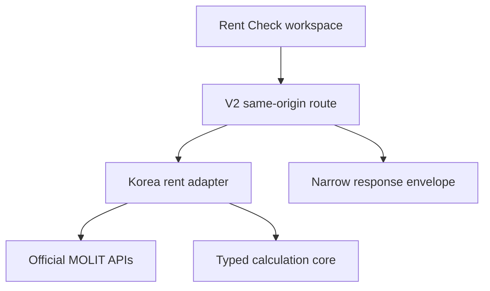

# signedprice Seoul Rent Check V2 Design

**Date:** 2026-08-30

**Status:** Written design for founder review

**Public brand and domain:** signedprice at `www.signedprice.com`

**Legacy production:** KoreaHomeGuide at `koreahomeguide.com`

## 1. Decision

Build Seoul Rent Check as the next signedprice V2 full-product slice at:

```text
/kr/seoul/tools/rent-check/
```

The existing `/kr/seoul/rent/` route remains the editorial decision overview. It links into the tool but does not become the tool itself.

V2 receives official Korean rental data through its own same-origin server route and a Korea-specific adapter. The browser never calls a government endpoint or the legacy KoreaHomeGuide API directly. Legacy CommonJS runtime code is not imported into the V2 Next.js application. Proven behavior is ported to typed TypeScript and locked with golden fixtures.

This slice does not redirect or retire `/tools/seoul-rent-check/` on KoreaHomeGuide. Both the new route and the whole signedprice V2 site remain `noindex` until the later migration gate.

## 2. Goals

- Let a user compare a Seoul rent quote with compatible official reported contracts.
- Preserve the trusted KoreaHomeGuide Rent Check calculation and evidence-selection behavior where it is correct.
- Correct known legacy gaps: ambiguous source period, missing methodology metadata, unsafe request races, `0 + 0` quotes, and stale-result error states.
- Apply the approved Claude Modernist system: Archivo, off-white ground, ink, cobalt action, square geometry, two-pixel structural rules, and low-card composition.
- Work as a connected analysis workspace on desktop and as a linear input-to-result flow on mobile.
- Keep the data source, contract-date basis, completed-month coverage, sample, method, and limitations visible.
- Preserve the current KoreaHomeGuide production site and its SEO assets until an explicit URL-cohort migration.

## 3. Non-goals

- No KoreaHomeGuide redirect, canonical change, sitemap change, or retirement.
- No Singapore or Dubai quote checking.
- No account, saved quote, email capture, alert, partner lead, brokerage, or marketplace flow.
- No KRW/USD/CNY quote-entry conversion in this slice. Official source values and inputs remain KRW.
- No Korean or Chinese locale in this slice; English is the V2 source contract.
- No building-level price claim from Explorer context when the check only filters by district, property type, area, deposit, and rent.
- No fabricated maintenance fee, furnishing, floor, view, condition, brokerage fee, deposit-return risk, or legal conclusion.
- No claim that cancellation and correction records are already fully reflected.
- No public indexing before the signedprice migration and SEO gate.

## 4. Route and navigation contract

| Surface | Route | Responsibility |
| --- | --- | --- |
| Seoul rent overview | `/kr/seoul/rent/` | Explain the decision, evidence boundary, and link to the tool |
| Seoul Rent Check | `/kr/seoul/tools/rent-check/` | Collect the quote, call official evidence, render the result |
| V2 Explorer | `/kr/seoul/explore/` | Select district, neighborhood, and building; hand off verified context |
| V2 API | `/api/markets/kr-seoul/rent-check/` | Validate, fetch, normalize, calculate, and return the typed envelope |
| Legacy Rent Check | `https://koreahomeguide.com/tools/seoul-rent-check/` | Continue production operation until cohort migration |

The Explorer building action changes from the editorial `/kr/seoul/rent/` destination to the tool route. It may pass only verified context:

```text
lawdCd
type
dong
building
```

Explorer parity fixtures currently contain no verified deposit, monthly rent, or area. Those values must never be invented or prefilled. `dong` and `building` are contextual labels only; the result must state that the comparison scope is district-level unless a future verified adapter explicitly narrows it.

The page resolves Explorer context through the shipped V2 registry, never by rendering raw query text. It validates the complete `lawdCd → dong → building` parent relationship and that the property type is supported for the route. An invalid, unknown, or orphan context value is ignored without becoming a label, API filter, analytics dimension, or scope claim.

## 5. System architecture

### 5.1 Runtime boundary



- The client calls only the signedprice same-origin V2 API.
- The V2 API reads `DATA_GO_KR_SERVICE_KEY` on the server. The value is never serialized to the client.
- The signedprice Vercel project must receive its own server-only `DATA_GO_KR_SERVICE_KEY`. A missing key keeps the feature unavailable and never activates a fixture or cross-domain fallback.
- The Korea adapter owns all Seoul and MOLIT-specific source semantics.
- The calculation core owns portable typed contracts and pure statistics only.
- No cross-domain call to `koreahomeguide.com/api/rent-check` is allowed.
- No fallback to fixtures, another market, scraped data, or zeros is allowed when the official source is unavailable.

### 5.2 Package responsibilities

```text
v2/packages/market-core
├─ Quote, Result, SourceCoverage, Rights and error types
├─ Money and area invariants
└─ pure median, percentile and percentile-rank functions

v2/packages/korea-rent
├─ Seoul district and housing-type registry
├─ MOLIT endpoint client and XML normalization
├─ completed-month coverage and retry policy
├─ Korea comparable selection and tier policy
├─ deposit-normalization policy
├─ versioned MOLIT rights-policy registry
└─ response source, rights, method and limitation metadata

v2/apps/web
├─ page and Modernist components
├─ form and request-state reducer
└─ same-origin API route and anti-corruption view model
```

`market-core` must not contain Seoul `lawdCd`, Korean housing classifications, MOLIT field names, KRW `만원` parsing, jeonse rules, or the Korean deposit-conversion policy. Those belong to `korea-rent`.

The Korea package registers the immutable, version-bearing ID `kr-molit-rent-v1` through the existing deny-by-default `RightsPolicy` contract. That ID is the single rights version used by the response and every cache key; there is no separate `rightsPolicyVersion` field. Before fetch, cache, derivation, or display, the server checks the corresponding `canFetch`, `canCache`, `canCreateDerived`, `canDisplay`, and `canUseCommercially` permissions. Raw persistence additionally requires `canStore`. An unknown policy ID or any missing permission denies the operation.

The requested cache TTL must be no greater than the registered `cacheTtl`; raw or normalized persistence must satisfy `retention`; response attribution is copied from the registered policy; and a non-placeholder `evidenceRef` is required before the adapter is enabled. `canIndex` remains separate from route readiness, so a legally indexable source cannot bypass signedprice's current product-level `noindex` gate.

## 6. Input contract

### 6.1 User fields

| Field | Contract |
| --- | --- |
| Area | One of Seoul's 25 verified `lawdCd` values |
| Housing type | Apartment, officetel, villa, detached/multi-unit, or studio UI alias |
| Size | Square metres, greater than 0 and no more than 2,000 |
| Deposit | Integer KRW, 0 to 20,000,000,000 |
| Monthly rent | Integer KRW, 0 to 100,000,000 |

Deposit and monthly rent cannot both be zero. Numeric input is finite and converted to safe integer KRW before the request. The API validates independently from the browser.

`studio` is not an official MOLIT property category. The API accepts `type=studio`; the Korea adapter maps it server-side to the `detached` source category. The response preserves `requestedHousingType`, `sourceHousingType`, and the mapping explanation. The UI displays an explicit warning that official records classify many studio and multi-unit homes under the detached/multi-unit source category. It must not imply exact type matching.

Every query parameter must occur exactly once. `lawdCd` is exactly five ASCII digits and must be in the Seoul registry. KRW inputs match `0|[1-9][0-9]*`; decimals, exponents, signs, negative zero, leading-zero variants, non-safe integers, and empty values are rejected. Area matches a positive canonical decimal with at most two decimal places. Validation produces one canonical typed request before cache lookup.

Square metres are the internal source of truth. Direct square-metre entry is canonicalized to at most two decimals. When the user edits a pyeong value, the client computes `round(pyeong × 3.3058, 2)` once and stores that square-metre value. Unit toggling derives display text from the stored square metres and never reconverts the rounded display value, so repeated toggles cannot drift. The server still validates the final canonical square-metre string independently.

### 6.2 Form layout

Desktop retains the proven structure:

1. Area / Housing type / Size
2. Deposit / Monthly rent / Check
3. Housing explanation / type-specific size presets / pyeong conversion assist

All primary controls are 52px high. Every actionable target is at least 44px. Labels are persistent. Native form semantics, fieldsets, visible focus, `aria-describedby`, and field-level errors are required.

Size presets preserve the verified KoreaHomeGuide contract:

| Housing type | Presets |
| --- | --- |
| Apartment | 35 / 60 / 85 m² |
| Officetel | 15 / 20 / 30 m² |
| Villa | 20 / 35 / 60 m² |
| Detached/multi-unit | 20 / 35 / 50 m² |
| Studio alias | 15 / 20 / 25 m² |

Changing housing type changes the available preset buttons but never overwrites a manually entered or Explorer-prefilled size. A size changes only through direct edit or an explicit preset click.

Mobile at 390px uses one column in this order:

1. context;
2. inputs;
3. action;
4. request status;
5. verdict;
6. evidence;
7. method and limitations.

## 7. Official data and comparable selection

### 7.1 Source coverage

- Official MOLIT reported rental contracts only.
- Contract-date basis.
- Current incomplete month is excluded using `Asia/Seoul`, not browser or UTC month boundaries.
- One server reference instant produces both the fetch-month list and the response coverage metadata.
- The adapter records `coverageThroughMonth` as the newest successfully and completely fetched source month and `latestContractMonth` separately as the newest contract month present in the selected evidence. Both use `YYYY-MM`; absence remains `null` rather than being inferred.
- `sourceRetrievedAt` and `responseGeneratedAt` are ISO 8601 instants.
- Original source values are normalized from `만원` to integer KRW.
- Apartment, officetel, villa, and detached/multi-unit source endpoints remain distinct.
- Every page is fetched until the parsed row count satisfies the provider's validated `totalCount`. A missing, malformed, truncated, or inconsistent page rejects the entire source month.
- A retry replaces the page buffer and can never append the same response twice. When the provider supplies a stable source record ID, it is used to remove an exact duplicate. When no such ID exists, coincidentally identical contracts are not guessed to be duplicates; each successfully parsed provider row is appended exactly once. Observed cross-page overlap without a stable ID makes the month unavailable instead of silently changing sample weight.
- Provider cancellation/correction fields are preserved when supplied. Only a known-cancelled record is excluded. Confirmed-active and status-unknown records remain eligible because current rental sources do not provide complete status coverage; every result therefore discloses the unknown-status count and limitation. Status counts are taken in the selected tier after type, date, area, deposit, rent-mode, and contract compatibility filters but immediately before known-cancelled records are removed.
- A failed or malformed upstream response produces an unavailable error unless a previously verified response remains within the explicitly labelled stale cache window. It never produces partial or fabricated evidence.

### 7.2 Comparable tiers

| Tier | Completed months | Size tolerance | Deposit tolerance | Minimum evidence |
| --- | ---: | ---: | ---: | ---: |
| 1 | 3 | ±15% | ±25% | 5 |
| 2 | 6 | ±20% | ±35% | 5 |
| 3 | 12 | ±25% | ±50% | 3 |

The adapter expands from Tier 1 to Tier 3 and stops when the minimum is met. For monthly rent, only positive monthly-rent contracts are used. For jeonse, only zero-monthly-rent contracts are used.

Legacy zero-target behavior is preserved: when the user's deposit is zero, the relative deposit filter matches only reported contracts with zero deposit. A fixture locks this behavior so it cannot change accidentally.

If enough new contracts exist for a tier, the comparison uses new contracts. Otherwise it uses the compatible new, renewal, and unknown contract records together and discloses that boundary.

## 8. Calculation policy

### 8.1 Rent Check policy

For a monthly-rent quote, each comparable contract is normalized to the user's deposit:

```text
comparable rent at user deposit
= reported monthly rent
  + (reported deposit - user deposit) × 5% ÷ 12
```

The user's asking value remains the quoted monthly rent. A normalized comparable value at or below zero is excluded.

For a jeonse quote, the asking deposit is compared with compatible reported jeonse deposits and monthly-rent conversion is not applied.

The method is versioned as:

```text
policyId: kr-rent-check-quote-normalization
version: 1
annualDepositRate: 0.05
```

The UI wording is:

> 5.0%/year signedprice comparison assumption

It must never be described as a statutory, legal, guaranteed, or market-mandated rate.

### 8.2 Precision and rounding

- Parsed provider and user KRW amounts are safe integer won.
- The adapter calculates each deposit-normalized comparable as an unrounded JavaScript number. It does not round each contract before statistics.
- Median and linearly interpolated P25/P75 operate on those unrounded normalized values, matching the approved legacy golden fixtures.
- Typical-range and median-fallback verdicts are decided from unrounded values.
- `differencePct` is calculated from the unrounded median and rounded to one decimal place only after the verdict is fixed.
- Public monetary summary fields are rounded to the nearest whole won with the positive-value behavior of `Math.round`. Percentile rank is a whole percentage.
- Raw official comparable deposit and rent values remain their original integer KRW amounts; the UI never overwrites them with adjusted estimates.

Tests cover half-won normalization, even-count medians, interpolated quartiles, and values immediately around verdict boundaries.

### 8.3 Explorer distinction

Explorer's map and market metric is an effective monthly housing-cost metric:

```text
(monthly rent + deposit × 5% ÷ 12) ÷ area
```

Rent Check's quote-normalization formula and Explorer's effective-cost metric are related but not interchangeable. They produce the same absolute price gap after translation, but percentage denominators can differ and may change a median-fallback verdict. V2 therefore preserves them as separate named and versioned policies. Any future unification is an explicit methodology migration with new fixtures, copy, version, and approval.

### 8.4 Verdict and evidence strength

| Evidence | Verdict basis | Presentation |
| --- | --- | --- |
| 5 or more compatible contracts | P25–P75 typical range | Below / within / above typical range, range, percentile and distribution |
| 3–4 compatible contracts | Median fallback | Below / around / above median using ±10%; labelled Limited |
| Fewer than 3 | Insufficient | No median, range, percentage difference, confidence or comparable rows |

Confidence remains evidence-based:

- High: Tier 1 with at least 7 contracts.
- Medium: Tier 1 or Tier 2 with at least 5 contracts.
- Low: Tier 3 with at least 3 contracts.

At most 10 comparable contracts are shown, newest contract date first.

## 9. API contract

### 9.1 Request

The first implementation uses a cacheable `GET` request because the quote contains no personal information and official-source calls are expensive:

```text
/api/markets/kr-seoul/rent-check/
  ?lawdCd=11590
  &type=officetel
  &deposit=10000000
  &rent=900000
  &area=28
```

Only the five calculation inputs are sent. Explorer context labels are not sent to the official data adapter.

### 9.2 Success envelope

```ts
type SeoulRentCheckEnvelope = {
  marketId: 'kr-seoul';
  status: 'success' | 'insufficient';
  requestedHousingType: 'apartment' | 'officetel' | 'villa' | 'detached' | 'studio';
  sourceHousingType: 'apartment' | 'officetel' | 'villa' | 'detached';
  typeMapping: {
    applied: boolean;
    explanation: string | null;
  };
  source: {
    provider: 'MOLIT';
    dataset: string;
    endpointVersion: string;
    parserVersion: string;
    rightsPolicyId: string;
    attribution: readonly string[];
  };
  coverage: {
    basis: 'contract_date';
    timezone: 'Asia/Seoul';
    coverageThroughMonth: string;
    latestContractMonth: string | null;
    sourceRetrievedAt: {
      earliest: string;
      latest: string;
    };
    responseGeneratedAt: string;
    monthsUsed: 3 | 6 | 12;
  };
  methodology: {
    policyId: 'kr-rent-check-quote-normalization';
    version: 1;
    annualDepositRate: 0.05 | null;
    verdictBasis: 'typical-range' | 'median-fallback' | null;
    contractSelection: 'new_only' | 'mixed' | null;
    eligibleContractTypeCounts: {
      new: number;
      renewal: number;
      unknown: number;
    };
    selectedContractTypeCounts: {
      new: number;
      renewal: number;
      unknown: number;
    };
    sourceRecordStatusCounts: {
      active: number;
      cancelled: number;
      unknown: number;
    };
  };
  result: SeoulRentCheckResult;
  comparables: readonly ComparableContract[];
  limitations: readonly string[];
};
```

The public comparable DTO is narrow: building label, area, deposit, monthly rent, contract date, and only the contract attributes required for an honest disclosure. Provider codes and unrelated normalized internal fields are not leaked.

`eligibleContractTypeCounts` describes all compatible non-cancelled records before the new-contract preference. `selectedContractTypeCounts` describes the records that actually drive the result. `sourceRecordStatusCounts` is counted immediately before known-cancelled records are excluded, so the UI can disclose what was removed and what remained unknown. When no compatible contract exists, `contractSelection` is `null` and all contract-type counts are zero.

Each source-month cache entry retains its own retrieval instant. `sourceRetrievedAt.earliest` is the oldest instant across every month used by the result; `.latest` is the newest. The UI must not summarize the whole evidence set as newer than the earliest instant.

### 9.3 HTTP, request security, and provider budget

Typed error codes cover invalid input, untrusted request source, rights-blocked data, missing server configuration, upstream timeout, malformed upstream response, and temporary source unavailability. User-facing copy remains concise and does not expose keys, endpoint details, or raw provider errors.

```ts
type SeoulRentCheckErrorCode =
  | 'invalid_request'
  | 'untrusted_request'
  | 'rate_limited'
  | 'configuration_missing'
  | 'rights_blocked'
  | 'source_timeout'
  | 'source_malformed'
  | 'source_unavailable'
  | 'internal_error';

type SeoulRentCheckErrorEnvelope = {
  status: 'error';
  error: {
    code: SeoulRentCheckErrorCode;
    message: string;
    retryable: boolean;
    retryAfterSeconds: number | null;
  };
};
```

| HTTP | Meaning | Cache |
| ---: | --- | --- |
| 200 | Success or insufficient official evidence | Runtime Cache internally; HTTP `no-store` |
| 400 | Invalid or repeated query input | `no-store` |
| 403 | Untrusted host/origin | `no-store` |
| 405 | Unsupported method | `no-store` |
| 429 | Vercel Firewall rate limit | Platform response; client waits 60 seconds before retry guidance |
| 500 | Internal invariant failure | `no-store` |
| 502 | Malformed or rejected provider response | `no-store` |
| 503 | Missing server key, timeout, rights-blocked source, or unavailable provider | `no-store` |

Allowed hosts are `www.signedprice.com`, `signedprice.com`, the current Vercel production URL, and the exact Preview host derived from Vercel deployment environment variables. A present `Origin` or `Referer` must match that host boundary; cross-site fetch metadata is rejected. No permissive CORS header is returned.

The Vercel Firewall rule is scoped to `GET /api/markets/kr-seoul/rent-check/`, counted by client IP with a 60-second fixed window and an initial 30-request threshold. It follows the required staged rollout: log-only observation, enforced Preview verification, production log review, then founder-published production `rate_limit` action returning 429. The endpoint is not considered publicly released before that final gate.

Because a Firewall 429 may be platform-owned rather than the JSON envelope above, the browser branches on HTTP status before parsing JSON. For 429 it uses a valid `Retry-After` header when present and otherwise applies a 60-second retry delay. For every other non-2xx response it attempts the typed envelope and falls back to one generic unavailable message if the body is not valid JSON.

One request has a 55-second total deadline, a five-second provider-attempt timeout, at most two retries per failed provider call, at most three concurrent provider calls, and a 48-call total provider budget. Reaching any deadline or budget rejects the incomplete result. Pagination follows validated `totalCount`; a budget is never treated as permission to return a truncated month.

### 9.4 Two-layer cache

The source cache and derived response cache are independent.

**Verified source-month cache**

```text
key = market + endpointVersion + sourceHousingType + lawdCd
      + dealYmd + pageSize + parserVersion + rightsPolicyId
TTL = 24 hours
```

The production adapter uses Vercel Runtime Cache through `@vercel/functions`. It is regional and isolated by Vercel project and environment, so no Preview entry can satisfy Production. A month is stored as page chunks plus a small manifest to stay below the 2MB item limit; the manifest is written only after all pages pass validation. Test and local environments use an injected deterministic cache implementation.

Only a complete, paginated, schema-valid, rights-permitted source month is cached. Partial, malformed, cancellation-processing errors and provider failures are never cached. Parser or rights-policy changes create a new namespace rather than reusing incompatible data.

**Derived quote-response cache**

```text
key = canonical request + coverage namespace + parserVersion
      + methodologyPolicyId + methodologyVersion + rightsPolicyId
fresh = 15 minutes
stale-if-error limit = 60 minutes
```

The derived response also uses Vercel Runtime Cache so the application controls the complete versioned key. It does not store user identity or any personal data. In-process promise coalescing only prevents duplicate concurrent work within one function instance; correctness and cross-request reuse never depend on that memory.

Every source and derived entry receives the stable roll-up tag `kr-seoul-rent-check` plus market, parser, methodology, and rights-policy tags. A deployment that changes parser, methodology, or rights behavior hard-deletes the stable roll-up tag with `dangerouslyDeleteByTag` before the new route is released. Stale invalidation is not sufficient when rights are reduced. The envelope returns the exact active IDs and versions.

HTTP response caching is disabled so an opaque URL-keyed CDN object cannot bypass an internal policy change:

```text
Cache-Control: private, no-store
X-Signedprice-Cache: hit | miss | stale
```

Request cache keys include all five calculation inputs. Each upstream call has a timeout and bounded retry. Concurrent identical source-month requests are coalesced. The final implementation records actual retrieval and coverage metadata rather than inferring it in the browser.

After 15 minutes, the route attempts synchronous revalidation. If revalidation fails while a verified derived response is still within the 60-minute stale-if-error limit, that response may be served only with its original `responseGeneratedAt` and the `stale` cache header. The client displays `Stale verified result`. When no valid stale response exists, the route returns unavailable. Every HTTP response, including errors and 429 responses, remains `no-store`; reuse occurs only inside the controlled Runtime Cache.

## 10. Client state and race safety

The workspace reducer has exactly these visible result states:

```text
idle
loading
success
insufficient
error
```

- Idle status takes no layout space. Static methodology guidance may remain visible.
- Loading disables duplicate submission and exposes a polite live status.
- Every new request aborts the previous request and receives a monotonically increasing request ID.
- A late response cannot overwrite a newer result.
- `draftInput` and `checkedInput` remain separate. Editing any checked field immediately invalidates the displayed verdict instead of presenting an old result as if it described the new draft.
- Error preserves the user's form values and hides stale verdict evidence. A Retry action and countdown render only when `retryable` is true. `rights_blocked` renders a named non-retry rights boundary; `configuration_missing`, `untrusted_request`, and internal invariant failures render non-retry unavailable/support guidance. They are never presented as temporary provider failures.
- Insufficient is a valid official-data result, not an error.
- No previous result remains visually active while a new result is loading or after validation fails.
- Successful mobile submission moves focus to the result heading; reduced-motion preference is respected.

## 11. Modernist UI composition

The page uses one connected evidence frame, not a collection of floating rounded cards.

### Desktop

- Compact market header and route context.
- Flush-left title: `Check the quote against reported contracts.`
- The connected frame is at most 1,440px wide. At 1,180px and above it uses `minmax(720px, 3fr) minmax(360px, 2fr)` so the three-field quote rows remain viable:
  - `01 Quote` contains the form.
  - `02 Market evidence` contains idle guidance or the current result.
- Below 1,180px, evidence moves below the full-width quote region before the form itself becomes a one-column mobile layout. Horizontal viewport overflow is forbidden at every breakpoint.
- `03 Comparable contracts` is a full-width evidence region below the frame.
- Source, methodology, period, and limitations form a final compact disclosure band.
- Numbers use tabular figures. Cobalt is reserved for action, focus, and result position.

### Mobile

- The connected frame becomes a single vertical document.
- Street-map or decorative imagery is not introduced.
- The result is not a fixed overlay or a non-scrolling sheet.
- Evidence dates, sample counts, periods, source, and limitations remain visible.
- The comparable table either scrolls within a labelled region or becomes complete contract rows; the date column is never hidden.

### Result semantics

- User input is labelled `Asking quote`.
- Contract records are labelled `Official reported contracts`.
- Deposit normalization and verdict are labelled `signedprice estimate`.
- Color is never the only status signal.
- Missing values render as unavailable or are omitted; they never render as `0`.

## 12. Required disclosure

Every result includes, in plain English:

- official reported contract data;
- contract-date basis;
- recent completed-month coverage and exact through-month;
- later correction or cancellation may change records;
- reported contracts are not current asking listings;
- the result is a market reference, not an appraisal or legal advice;
- the 5% rate is a signedprice comparison assumption;
- floor, condition, furnishings, maintenance fees, view, renovation, exact brokerage fee, and deposit-return risk are not captured unless verified separately.

The product must say `records may later be corrected or cancelled`. It must not say `corrections and cancellations are fully reflected` because the current source normalizer does not preserve a complete cancellation status.

## 13. SEO and migration

- The V2 root metadata continues to enforce `noindex, follow`.
- No canonical, hreflang, or sitemap entry is added during this slice.
- `www.signedprice.com` is the currently observed primary host; `signedprice.com` redirects to it over HTTPS.
- The legacy page remains canonical and operational.
- The future migration manifest records one exact mapping:

```text
https://koreahomeguide.com/tools/seoul-rent-check/
→ https://www.signedprice.com/kr/seoul/tools/rent-check/
```

This document records the intended mapping but does not authorize the redirect. Redirect, V2 self-canonical, sitemap inclusion, internal-link switch, and monitoring start together only after the cohort gate.

## 14. Test and release gates

### Unit and contract tests

- All 25 Seoul district codes and supported property types.
- Studio alias warning, server mapping, request/source type provenance, and cache separation from true detached requests.
- Repeated parameters, canonical numeric grammar, safe-integer KRW, technical upper bounds, negative zero, exponent/decimal rejection, and `0 + 0` rejection.
- Pyeong-to-square-metre two-decimal canonicalization and drift-free repeated unit toggling.
- Completed-month calculation uses `Asia/Seoul`, excludes the current month, and passes month-boundary fixtures where UTC and Seoul dates differ.
- Tier 1, 2, and 3 expansion and early stop.
- Zero-deposit exact-match tolerance parity.
- New-contract preference and mixed-contract fallback.
- Nullable `contractSelection`, eligible-versus-selected contract-type counts, active-plus-unknown inclusion, known-cancelled exclusion, and pre-exclusion source record-status counts.
- Monthly-rent and jeonse separation.
- Exact 5% quote-normalization fixtures.
- Unrounded comparable statistics, whole-won output rounding, one-decimal difference, interpolated quartiles, and verdict-boundary precision.
- Explicit proof that Explorer and Rent Check policies are separate.
- Median, percentile, rank, typical-range, median-fallback, confidence, and insufficient behavior.
- Narrow response DTO and complete source, coverage, rights, method, and limitation metadata.
- Full provider pagination through `totalCount`, retry-without-double-append, stable-ID duplicate handling, overlap rejection when identity is unavailable, and no partial-month result.
- Known-cancelled exclusion, unknown status preservation, and no complete-cancellation claim.
- Deny-by-default rights checks before fetch, cache, derivation, display, and optional storage; an unknown immutable policy ID is rejected and TTL, retention, attribution, and evidence requirements are enforced.
- Vercel Runtime Cache page chunks and atomic month manifest, version-keyed derived Runtime Cache, stable roll-up hard deletion, TTLs, stale-if-error labelling, coalescing, environment isolation, HTTP `no-store`, and cache-status header behavior.
- Timeout, retry, malformed response, unavailable source, and no-fallback behavior.
- Total deadline, provider-call budget, concurrency cap, trusted production/Preview host, origin, method, and HTTP status contracts.
- Typed JSON error envelopes plus non-JSON Vercel Firewall 429 handling with header-or-60-second retry behavior.
- Multi-month earliest/latest source retrieval instants and exact coverage-versus-latest-contract month semantics.
- Golden parity fixtures for all intended legacy-preserving behavior.
- Named fixtures for every intentional divergence from legacy behavior.

### Component and browser tests

- Correct route metadata and global noindex behavior.
- Desktop aligned two-row form and 52px controls.
- Mobile 390×844 linear completion flow and no horizontal viewport overflow.
- Idle, loading, success, insufficient, and error states.
- Retryable error, non-retry unavailable, and named rights-blocked rendering from the typed error contract.
- Abort and stale-response protection.
- Draft-input edits invalidate checked results, and verified cached results older than 15 minutes are visibly labelled stale.
- Keyboard-only form completion, visible focus, live status, and result focus.
- P25–P75 range has equivalent text and is not color-only.
- Comparable evidence retains contract date on mobile.
- Source, exact through-month, sample, method, and limitations are never hidden.
- Explorer handoff changes only verified context and does not fabricate quote values.
- Invalid or orphan `dong`/`building` query values never render and never change comparison scope.

### Repository and deployment gates

- V2 unit, typecheck, lint, build, and desktop/mobile Playwright suites pass.
- Existing V2 baseline does not regress.
- Legacy Phase 0 remains exactly separated from the 23 known pre-existing failures.
- The signedprice Vercel Preview and Production environments have the server-only MOLIT key before live API verification; absence remains a deny-safe unavailable state.
- Environment changes are followed by a new exact-commit-SHA deployment; an older deployment is never treated as having received the new secret.
- The Vercel Firewall rule completes log review, enforced Preview verification, and founder-published production rate limiting before the API is publicly released.
- Parser, methodology, or rights changes hard-delete the stable `kr-seoul-rent-check` cache tag before the new deployment is released; a rights reduction never uses stale invalidation.
- Independent review reports Critical 0 and Important 0.
- Vercel Preview is browser-verified before merge.
- Only then merge to remote `main`, verify V2 Production, and verify `www.signedprice.com` again.
- Production smoke covers one monthly-rent quote and one jeonse quote against live official data, response cache headers and stale metadata, redacted runtime logs, API 5xx count, TLS, and the apex-to-`www` redirect.
- KoreaHomeGuide Production receives no redirect or behavioral change in this slice.

## 15. Acceptance criteria

The slice is accepted when a user can open the signedprice Seoul Rent Check, submit a valid quote, receive an honest result or insufficient state from official completed-month contract data, understand the deposit-normalization assumption, inspect comparable evidence, and recover safely from errors on desktop and mobile.

Acceptance also requires that signedprice never presents an unsupported building-level claim, unlabelled stale response, fabricated fallback, legal-rate claim, hidden evidence date, or indexed duplicate of the legacy Rent Check page.
