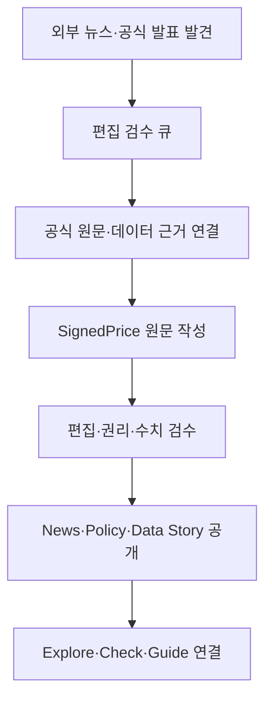
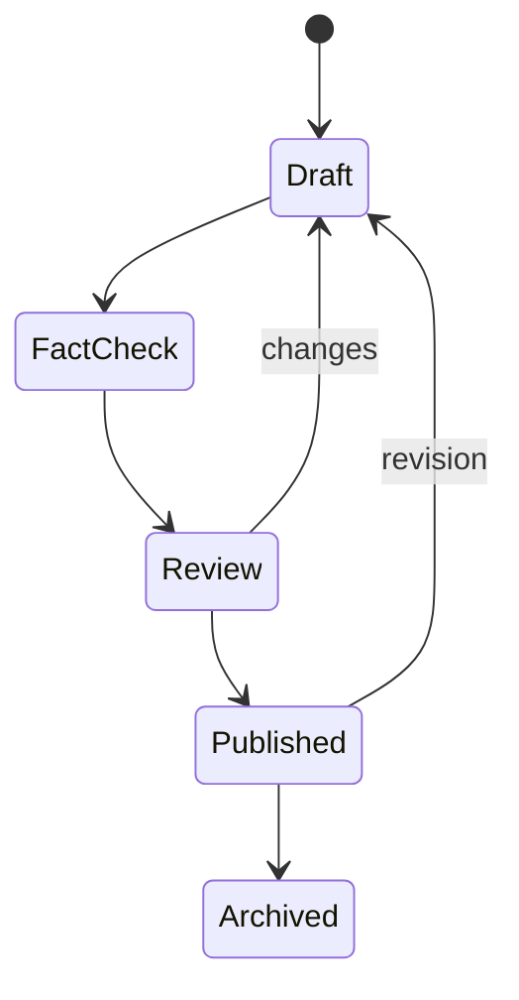

# SignedPrice 데이터 뉴스룸·정책·인포그래픽 콘텐츠 시스템 설계

**작성일:** 2026-09-04

**상태:** 사용자 방향 승인 완료, 문서 검토 대기

**적용 범위:** 글로벌 콘텐츠 정보 구조, News 개편, 정책 추적, 데이터 스토리와 인포그래픽, Guides, 콘텐츠 DB, 편집 workflow, 홈페이지·데이터 도구 연결

**제외 범위:** Dubai 데이터 수집 및 Dubai 전용 콘텐츠 발행, 자동 기사 작성·자동 발행, AdSense 신청·광고 송출, 중개·투자 리드 기능

**변경 관계:**

- `2026-09-04-signedprice-editorial-growth-ui-design.md`의 에디토리얼 프로프테크, 영어 70%·간체중문 30%, 광고 분리 원칙을 유지한다.
- `2026-09-04-signedprice-three-market-experience-data-model-design.md`의 시장·언어 분리, evidence release, content–entity 연결 원칙을 유지한다.
- `2026-09-04-signedprice-production-coherence-data-readiness-design.md`의 글로벌 header, UI 수치, 서울·싱가포르 우선순위를 유지한다.
- 이 문서는 글로벌 header의 `Journal` 명칭을 `News`로 교체하고, 기존 `Insights`를 News 내부의 `Data Stories`로 통합한다.

## 1. 편집 제품 정의

SignedPrice는 외부 부동산 기사를 모아 보여주는 뉴스 포털이 아니다. 공개 콘텐츠의 역할은 정책과 시장의 변화를 실제 거래 근거 및 사용 가능한 도구와 연결해 사용자의 판단을 돕는 것이다.

> SignedPrice는 정책 변화와 실제 거래 데이터를 함께 해석하는 국제 부동산 데이터 미디어다.

현재 콘텐츠와 도구는 다음 질문에 답해야 한다.

1. 무엇이 바뀌었는가?
2. 언제부터 적용되는가?
3. 누구와 어느 지역에 영향을 주는가?
4. 거래 데이터에서는 어떤 변화가 관측되는가?
5. 사용자는 어느 Explore·Check·Guide에서 자신의 조건을 확인할 수 있는가?

Dubai는 글로벌 시장 선택기에 `research-only` 상태로 남기되, 이번 범위에서 뉴스 수집·정책 추적·데이터 스토리 발행 대상에 포함하지 않는다. 편집 생산은 서울과 싱가포르에 집중한다.

## 2. 현재 구조 진단

### 2.1 공개 정보 구조

- `News`, `Insights`, `Guides`가 분리되어 있지만 사용자가 세 메뉴의 차이를 즉시 알기 어렵다.
- 글로벌 header와 시장별 header에서 News·Insights·Guide의 명칭과 위치가 다르다.
- 데이터 도구와 콘텐츠가 별도 페이지군처럼 작동해, 기사를 읽은 뒤 관련 지역이나 가격을 직접 확인하기 어렵다.

### 2.2 News 데이터

- `news_articles`에는 Naver·Google/official RSS에서 수집한 외부 항목과 SignedPrice brief가 함께 저장된다.
- 공개 News workspace는 외부 headline, provider 상태, evidence 상태를 한 화면에 보여주어 내부 검수 도구처럼 보인다.
- 외부 기사 발견과 SignedPrice의 편집 판단이 같은 `article` 개념으로 표현되어 출처·책임 경계가 흐려진다.
- 현재 검증 News schema는 `kr-seoul`, `en`만 허용해 글로벌·다국어 편집 구조로 확장하기 어렵다.

### 2.3 Insights와 Guides

- `content_articles`는 제목·요약·Markdown·상태만 저장해 정책 시행일, 영향 대상, evidence release, 관련 도구, infographic을 구조화할 수 없다.
- Insights와 Guides의 콘텐츠 모델이 역할에 비해 유사하고, 홈페이지·시장·건물과의 관계가 코드에 흩어져 있다.
- 기존 본문 block은 paragraph, heading, list만 지원해 표·차트·정책 비교·출처 panel이 독립 계약을 갖지 못한다.

## 3. 채택한 편집 구조

세 가지 접근을 비교한다.

| 접근 | 장점 | 한계 | 판단 |
| --- | --- | --- | --- |
| 외부 뉴스 큐레이션 중심 | 발행량을 빠르게 늘릴 수 있음 | 차별성·검색 가치·법적 책임·품질 통제가 약함 | 제외 |
| 정책 전문 사이트 | 신뢰와 검색 의도가 명확함 | 시장 데이터와 기존 Explore·Check를 충분히 활용하지 못함 | 보조 축으로 채택 |
| **분석형 데이터 뉴스룸** | 정책·뉴스·거래 데이터·도구가 하나의 여정으로 연결됨 | 편집 검수와 구조화된 데이터가 필요 | **채택** |

외부 뉴스는 내부 발견 계층, 공식 자료는 정책·근거 계층, SignedPrice 콘텐츠는 공개 편집 계층으로 분리한다. headline 수집량을 공개 발행량으로 취급하지 않는다.

## 4. 글로벌 정보 구조

### 4.1 주 내비게이션

글로벌 header는 다음 네 항목을 사용한다.

1. `Markets`
2. `Prices`
3. `News`
4. `Guides`

- 기존 `Journal` 표기는 `News`로 교체한다.
- 기존 `Insights`는 글로벌 주 메뉴에서 제거하고 News의 `Data Stories`로 이동한다.
- 시장 로컬 내비게이션의 `Overview`, `Explore`, `Check`, `Rankings`, `Corrections`는 유지한다.
- `News`와 `Guides`는 글로벌 콘텐츠지만 market filter와 entity link를 가진다.

### 4.2 News 정보 구조

`/news/`는 다음 네 탭을 가진다.

| 탭 | 공개 콘텐츠 | 기본 정렬 |
| --- | --- | --- |
| Latest | 승인된 Policy·Market·Data Story 최신 항목 | 최신 공개·갱신순 |
| Policy | 정부·공공기관 정책 변경과 시행 추적 | 시행 예정 우선, 이후 갱신순 |
| Market | 거래량·가격·공급·임대시장 변화의 짧은 분석 | 최신 공개순 |
| Data Stories | 데이터 분석과 infographic 중심 장문 | 최신 공개순 |

시장 filter는 `All / Seoul / Singapore`만 제공한다. Dubai는 발행 대상이 생길 때까지 filter에 표시하지 않는다.

Canonical route는 다음으로 고정한다.

- English index: `/news/`
- English article: `/news/{slug}/`
- Simplified Chinese index: `/zh-cn/news/`
- Simplified Chinese article: `/zh-cn/news/{slug}/`
- Korean index: `/ko/news/`
- Korean article: `/ko/news/{slug}/`

기존 `/kr/seoul/news/`와 detail route는 같은 콘텐츠의 새 canonical route로 permanent redirect한다. 검색 색인이 없는 내부 workspace는 `/internal/news-desk/`로 이동하고 인증 경계를 둔다.

### 4.3 Guides

Guides는 시간이 지나도 반복 검색되는 실용 설명만 담당한다.

- Renting
- Buying
- Contracts & rights
- Neighborhoods
- Using market data

정책 발표는 Guide로 발행하지 않는다. 정책 변경으로 Guide 내용이 달라지면 관련 policy event를 연결하고 본문·갱신일·revision note를 업데이트한다.

## 5. 콘텐츠 유형 계약

### 5.1 News Brief

**목적:** 중요한 시장 변화를 300–600단어로 빠르게 설명한다.

필수 구성:

1. 직접 답변형 headline
2. 2–3문장의 요약
3. `What changed`
4. `Why it matters`
5. 데이터로 확인 가능한 범위
6. 원문·공식 출처
7. 관련 시장 또는 도구

외부 기사만 존재하고 공식 원문이나 호환 데이터가 없는 경우 `SignedPrice finding`이라고 표현하지 않는다.

### 5.2 Policy Update

**목적:** 정부·공공기관의 정책 생애주기와 사용자 영향을 추적한다.

필수 구성:

- 발표일과 시행일
- 상태: announced, consultation, enacted, effective, amended, expired
- 관할 국가·도시
- 담당 기관
- 영향 대상: renter, buyer, owner, investor, landlord 중 해당 값
- 변경 전·후 구조
- 적용 조건과 예외
- 공식 원문
- 최종 법률·세무 자문이 아니라는 경계
- 관련 Guide·Check·Explore

정책이 수정되면 별도 중복 페이지를 만들지 않는다. 같은 policy identity에 event를 추가하고, 중요한 변화는 revision note가 있는 새 article version으로 공개한다.

### 5.3 Market Brief

**목적:** Released transaction evidence에서 확인되는 시장 변화를 500–900단어로 설명한다.

필수 구성:

- 시장·지역·주거 부문
- 관측 기간과 비교 기간
- 표본 수
- 값·단위·통화
- 변화와 변화하지 않은 부분
- 비교 불가능한 경계
- Explore filter deep link

### 5.4 Data Story

**목적:** 하나의 질문을 데이터, 설명, infographic으로 깊게 분석한다.

분량은 800–1,600단어를 기준으로 하며 다음을 포함한다.

- 질문과 한 문장 결론
- cohort·기간·산식
- 핵심 infographic 1–3개
- 표본과 분포
- 지역 또는 유형별 차이
- 해석 한계
- 관련 Explore·Check
- 방법론과 다운로드 가능한 공개 근거가 있을 때 해당 링크

### 5.5 Guide

**목적:** 반복 가능한 의사결정 절차를 설명한다.

필수 구성:

- 대상 독자
- 직접 답변
- 단계별 절차
- 필요한 문서·확인사항
- 현재 정책 기준일
- 실제 예시
- 관련 Policy Update
- 관련 Check·Explore

## 6. 공개 News 화면

### 6.1 Index

첫 화면에는 다음만 둔다.

1. `News` 제목과 한 문장 편집 약속
2. Latest / Policy / Market / Data Stories 탭
3. All / Seoul / Singapore 시장 filter
4. 대표 story 1개
5. 최신 항목의 편집 목록

- provider 연결 상태, API credential, ingestion 진단을 공개 index에 표시하지 않는다.
- 같은 크기의 카드 벽 대신 대표 1개와 행 기반 목록을 사용한다.
- 각 행은 content type, market, headline, summary, published/updated date, evidence state를 표시한다.
- 썸네일은 승인 미디어 또는 infographic이 있을 때만 사용한다.

### 6.2 Article

Article 첫 화면은 다음 순서를 사용한다.

1. content type과 market
2. headline과 deck
3. 작성·검수·공개·갱신일
4. 핵심 infographic 또는 policy before/after
5. 3개 이하의 핵심 요점

본문은 680–720px 폭을 사용하고 infographic·비교표만 최대 1120px까지 확장한다. 출처는 주장의 가까운 위치에 표시하며 전체 reference 목록도 본문 말미에 제공한다.

### 6.3 홈페이지 연결

홈페이지는 다음 다섯 구역으로 고정한다.

1. 세 도시 시장 선택 hero
2. Compare markets, Explore, capability 기반 Check/Research
3. `What changed` 정책·시장 변화 2건
4. 대표 Data Story infographic 1건
5. 사용자 과업별 Guides 편집 목록

기능 링크 묶음을 페이지 끝에 다시 만들지 않는다. News와 Guide 안에서 관련 도구를 문맥에 맞춰 연결한다.

## 7. Policy Tracker

### 7.1 사용자 화면

`/news/policy/`는 단순 기사 목록이 아니라 정책 상태를 읽을 수 있는 tracker다.

- `Effective soon`: 90일 이내 시행
- `Recently changed`: 최근 90일 내 amendment 또는 effective
- `Active policies`: 현재 적용 중인 핵심 정책
- `Archive`: expired 또는 superseded

각 policy row는 제목, 관할, 영향 대상, 발표일, 시행일, 상태, 마지막 확인일을 보여준다. 날짜가 정해지지 않은 경우 `Date not confirmed`라고 표시하며 추정 날짜를 만들지 않는다.

### 7.2 정책 변경 비교

before/after block은 다음 필드를 가진다.

- aspect: 무엇을 비교하는가
- before label과 value
- after label과 value
- effective date
- qualifier 또는 exception
- source reference

하나의 정책에서 비교 가능한 항목이 6개를 넘으면 표를 축약하고 상세 항목을 본문으로 이동한다.

### 7.3 공식성 경계

- 정책 사실은 정부·공공기관·법령 원문을 primary source로 사용한다.
- 언론 보도는 발견과 맥락 보조에만 사용한다.
- 법률·세무 해석은 사실, SignedPrice 해석, 확인 필요 사항으로 구분한다.
- 시행 전 정책은 `announced`, `consultation`, `enacted` 상태를 정확히 표시한다.
- 원문이 변경·삭제되면 마지막 확인 상태를 기록하고 해당 주장을 재검토한다.

## 8. 인포그래픽 시스템

### 8.1 원칙

Infographic은 장식용 이미지가 아니라 evidence release에서 생성되는 구조화된 콘텐츠 block이다. 값, 단위, 표본, 기간, 출처가 없는 infographic은 공개하지 않는다.

초기 template은 다섯 종류로 제한한다.

| Template | 질문 | 상호작용 |
| --- | --- | --- |
| Policy before/after | 무엇이 바뀌는가 | 항목별 변화와 시행일 |
| Policy timeline | 언제 발표·시행되는가 | event별 공식 원문 |
| District comparison | 지역 간 가격·거래 차이는 무엇인가 | 지역 선택 시 Explore deep link |
| Market trend | 시간에 따라 무엇이 변했는가 | 기간·series 설명 |
| Cost structure | 전세·월세·매매 비용이 어떻게 구성되는가 | 관련 Check 입력 시작 |

### 8.2 렌더링

- 웹 본문에서는 접근 가능한 HTML과 SVG로 server render한다.
- 색만으로 series를 구분하지 않고 label, pattern 또는 marker를 함께 사용한다.
- 차트에는 title, summary와 화면에서 펼쳐 볼 수 있는 원값 data table을 제공한다.
- Tooltip에만 핵심 값을 숨기지 않는다.
- 390px에서는 차트를 축소하지 않고 series·열의 우선순위를 다시 편집한다.
- 공유 이미지는 발행 시점에 정적 PNG로 생성하고 content hash와 evidence release ID를 저장한다.
- 공유 PNG는 원본 SVG/HTML을 대체하지 않는다.

### 8.3 시각 계약

- 기존 네이비·블루·화이트를 사용하고 새 장식 팔레트를 만들지 않는다.
- 데이터 series는 최대 5개다. 5개를 넘으면 small multiple 또는 filter로 나눈다.
- 3D, gradient fill, gauge, 장식 아이콘, 출처 없는 큰 숫자를 사용하지 않는다.
- 제목 18–24px, label 12px 이상, 본문 14px 이상을 사용한다.
- 출처·기간·표본은 infographic 하단 고정 영역에 표시한다.

## 9. 콘텐츠 데이터 모델

### 9.1 외부 발견 계층

기존 `news_articles`는 자동 수집 결과를 보존하는 `external_news_items` 역할로 전환한다. 초기 migration에서는 table을 파괴적으로 rename하지 않고 호환 repository를 둔다.

추가·정규화 필드:

- provider와 provider item ID
- canonical URL과 publisher
- market 후보와 topic 후보
- first seen, last seen, source published date
- duplicate group
- review state: new, shortlisted, rejected, used
- linked official source IDs

외부 item은 공개 콘텐츠 ID가 아니며 직접 canonical article route를 만들지 않는다.

### 9.2 공개 콘텐츠

기존 `content_articles`를 다음 계약으로 확장한다.

`content_articles`

| 필드 | 목적 |
| --- | --- |
| `id`, `slug`, `locale` | 언어별 안정 identity와 route |
| `translation_group_id` | EN·KO·zh-CN 관계 |
| `content_type` | news-brief, policy-update, market-brief, data-story, guide |
| `market_id`, `primary_geography_id` | 주요 시장·지역 |
| `title`, `deck`, `summary` | 편집 표현 |
| `body_document` | versioned structured block document |
| `status` | draft, fact-check, review, scheduled, published, archived |
| `published_at`, `updated_at` | 공개·갱신 시간 |
| `reviewed_at`, `reviewed_by` | 편집 책임 |
| `evidence_state` | verified, partial, not-applicable, withdrawn |
| `canonical_path` | canonical route |

고유키는 `(locale, slug)`이며 published row는 `reviewed_at`, `reviewed_by`, primary source 또는 evidence state를 반드시 가진다.

### 9.3 정책

`policy_topics`

- stable policy identity
- jurisdiction과 administering organization
- title과 normalized topic
- current status
- announced/effective/expiry dates
- affected audiences
- official landing page
- current article ID

`policy_events`

- policy topic ID
- event type: announcement, consultation-open, consultation-close, enacted, effective, amended, suspended, expired
- occurred date와 effective date
- official source ID
- summary와 structured change payload
- verification state와 checked date

### 9.4 출처·근거

`content_sources`

- source kind: official-document, official-dataset, external-report, external-news
- publisher, title, URL, published/retrieved dates
- rights·citation policy
- content hash 또는 evidence release ID

`content_source_links`

- content article ID
- source ID
- role: primary, supporting, context
- claim anchor

공개 수치 주장은 compatible evidence release 또는 primary official source로 역추적되어야 한다.

### 9.5 인포그래픽

`infographic_specs`

- ID와 template ID
- content article ID
- locale
- title과 accessible summary
- evidence release IDs
- series·category·unit·period configuration
- Explore/Check deep-link configuration
- renderer version
- review state

`infographic_renders`

- infographic spec ID
- renderer version과 render hash
- width·height·format
- owned-object URL
- generated/published dates

수치를 직접 SVG path 또는 PNG에만 저장하지 않는다. spec과 evidence link가 재현 가능해야 한다.

### 9.6 연결·개정

`content_entity_links`는 market, geography, property entity, policy topic을 article과 연결한다. link role은 primary-subject, supporting-evidence, related-tool, related-guide를 사용한다.

`content_revisions`는 editor, change summary, changed fields, created date, previous revision hash를 보존한다. 정책·수치·결론이 바뀌면 단순 `updated_at` 변경만 하지 않고 revision note를 공개한다.

## 10. 편집 Workflow

### 10.1 수집·발견

- Naver·Google News/RSS 수집은 내부 desk에만 적재한다.
- 공식 기관 발표와 dataset release는 별도 source kind로 적재한다.
- 중복 headline은 canonical URL, normalized title, source date를 이용해 묶는다.
- 자동 분류는 market·topic 후보만 제안하고 publish state를 변경하지 않는다.

### 10.2 작성·검수

공개 전 필수 gate:

1. headline과 summary의 직접성
2. primary source 확인
3. 날짜·통화·단위·표본 확인
4. evidence release compatibility
5. infographic data와 본문 숫자 일치
6. 관련 Explore·Check·Guide link 유효성
7. 저작권·인용·이미지 권리
8. locale별 사람의 편집 검수

자동 생성 문장은 초안 보조로도 수치·정책 사실을 새로 만들 수 없다. 시스템이 수집 결과를 자동으로 공개하는 경로를 만들지 않는다.

### 10.3 갱신

- Policy Update는 event 발생 시 검수 큐에 다시 들어간다.
- Market Brief와 Data Story는 사용 evidence release가 superseded되면 stale review queue에 들어간다.
- Guide는 연결된 policy topic이 amended/effective/expired로 바뀌면 갱신 대상으로 표시한다.
- 수정이 결론을 바꾸면 revision note를 공개하고 이전 version hash를 보존한다.

## 11. 언어·검색·배포

- 초기 생산 비중은 English 70%, Simplified Chinese 30%를 유지한다.
- 한국어는 정책 원문 이해와 핵심 UI·정책 요약을 우선 제공하되 대량 생산 목표를 두지 않는다.
- 한 언어를 자동 번역해 즉시 published 상태로 만들지 않는다.
- translation group이 있어도 각 locale은 독립 title, deck, body, sources, reviewed state를 가진다.
- canonical, hreflang, NewsArticle/Article JSON-LD는 published content type과 locale에 맞춘다.
- 정책 날짜와 수정일을 검색 snippet에 정확히 반영한다.
- 지역명·정책명만 바꾼 대량 페이지는 만들지 않는다.

## 12. 초기 콘텐츠 포트폴리오

첫 공개 묶음은 품질 검수를 위한 최소 포트폴리오다.

| 유형 | English | zh-CN | 합계 |
| --- | ---: | ---: | ---: |
| Policy Update | 6 | 2 | 8 |
| Market Brief | 4 | 1 | 5 |
| Data Story + infographic | 4 | 2 | 6 |
| Guide | 7 | 3 | 10 |
| 합계 | 21 | 8 | 29 |

- 모든 항목은 서울 또는 싱가포르를 다룬다.
- Policy Update 8개와 Data Story 6개는 각각 하나 이상의 공식 source 또는 evidence release를 가진다.
- Data Story 6개에는 핵심 infographic이 최소 1개씩 포함된다.
- Guide 10개는 관련 Policy 또는 Explore·Check link를 최소 1개 가진다.
- 수량을 채우기 위해 출처나 독자 질문이 중복되는 글을 발행하지 않는다.

장기 AdSense 준비 목표는 기존 승인 기준인 English 30–40개, zh-CN 10–15개를 유지한다. 위 첫 묶음의 색인·완독·도구 진입 성과를 확인한 뒤 확장한다.

## 13. 구현·출시 순서

### Release A — 콘텐츠 기반

- global navigation을 Markets / Prices / News / Guides로 확정
- external discovery와 published content repository 경계 분리
- content article·source·policy·infographic·entity-link migration 추가
- 기존 route와 repository의 compatibility layer 유지

**출시 조건:** 기존 공개 article이 사라지지 않고 새 content type·locale·source contract로 읽힌다.

### Release B — Newsroom

- `/news/` index와 네 탭 구현
- provider 진단 UI를 인증된 internal desk로 이동
- canonical content article route와 기존 route redirect 적용
- market·type filter와 loading·empty·error 상태 구현

**출시 조건:** 공개 News에는 approved SignedPrice content만 표시되고 외부 headline은 직접 article route를 갖지 않는다.

### Release C — Policy Tracker

- policy topic·event ingestion과 편집 UI
- upcoming/recent/active/archive 목록
- before/after와 timeline block
- Guide stale notification 연결

**출시 조건:** 대표 정책에서 발표·시행·변경 이력과 공식 원문이 재현된다.

### Release D — Infographic

- 다섯 template의 spec validator와 renderer
- accessible HTML/SVG와 data table
- publish-time social image render와 hash 저장
- district·Check deep link 상호작용

**출시 조건:** 모바일·키보드·스크린리더에서 핵심 데이터가 손실되지 않고 evidence release와 값이 일치한다.

### Release E — 콘텐츠 이관·첫 포트폴리오

- 기존 News·Insights·Guides 전수 분류
- 중복·내부 진단형·근거 부족 콘텐츠 archive
- 29개 첫 포트폴리오 작성·검수·연결
- homepage What changed·Data Story·Guide 섹션 연결

**출시 조건:** 모든 공개 콘텐츠가 유형·시장·locale·source·review·related tool 계약을 통과한다.

### Release F — AdSense 전 검수

- canonical·hreflang·structured data·sitemap 확인
- 광고 없는 예약 slot의 레이아웃 안정성 확인
- content index와 article Core Web Vitals 측정
- 검색 색인, 내부 이동, 완독, Explore·Check 진입 event 확인

**출시 조건:** 정책 페이지와 데이터 도구 사이의 대표 사용자 여정, 전체 test/type/lint/build, Preview 시각 검수가 통과한다. AdSense 신청은 별도 승인으로 진행한다.

## 14. 테스트와 수용 기준

### 14.1 데이터 계약

- external item은 published content route를 생성하지 않는다.
- published content는 reviewer와 source/evidence state를 가진다.
- 정책 status와 날짜 조합이 유효하지 않으면 발행할 수 없다.
- infographic의 series 값은 연결된 evidence release와 일치한다.
- superseded evidence를 사용하는 content는 stale review queue에 들어간다.
- 번역 article은 locale별 독립 review 없이 공개되지 않는다.

### 14.2 Route·SEO

- `/news/`의 네 탭과 시장 filter가 canonical URL을 유지한다.
- 기존 Seoul News route가 대응하는 새 canonical route로 permanent redirect한다.
- locale 전환이 같은 translation group을 유지한다.
- unpublished·internal desk·external item은 색인되지 않는다.
- JSON-LD의 datePublished, dateModified, author/editor, source가 화면과 일치한다.

### 14.3 시각·접근성

- 1440px, 1024px, 390px에서 News index, Policy, Data Story, Guide를 검수한다.
- 공개 text는 12px 미만을 사용하지 않고 control은 44px 이상이다.
- infographic이 색 없이도 이해되며 data table 또는 text alternative를 가진다.
- 긴 정책명·중문 제목·통화·날짜가 겹치거나 잘리지 않는다.
- loading·empty·stale·withdrawn 상태가 정상 article보다 시각적으로 강하지 않다.

### 14.4 편집 품질

- headline은 독자가 무엇이 달라졌는지 직접 이해할 수 있다.
- 정책 주장은 primary official source로 추적된다.
- 거래 수치는 기간·표본·단위·evidence release를 가진다.
- 외부 기사 문장을 재게시하지 않고 원문으로 연결한다.
- 모든 article은 관련 도구 또는 Guide가 없을 때 억지 CTA를 만들지 않는다.
- correction과 중요한 revision을 숨기지 않는다.

## 15. 비목표

- Dubai의 정책·거래·프로젝트 콘텐츠를 이번에 수집·발행하지 않는다.
- 일반 부동산 속보 전체를 포괄하지 않는다.
- Naver·Google 결과를 자동 요약해 공개하지 않는다.
- 조회수를 위해 선정적 가격 전망·매수 추천·출처 없는 순위를 만들지 않는다.
- infographic을 장식 이미지나 데이터 없는 소셜 카드로 만들지 않는다.
- CMS 전체를 새 SaaS로 교체하지 않는다.
- newsletter, push 알림, 사용자 댓글은 초기 Newsroom 출시에 포함하지 않는다.
- AdSense 광고를 News·Policy·Data Story에 실제로 송출하지 않는다.

## 16. 최종 완료 조건

1. 글로벌 메뉴가 Markets / Prices / News / Guides로 통일된다.
2. News가 Latest / Policy / Market / Data Stories의 네 공개 유형을 명확히 구분한다.
3. 외부 뉴스 수집은 내부 desk로 격리되고 자동 공개 경로가 없다.
4. 정책 페이지가 발표·시행·변경·종료와 공식 원문을 추적한다.
5. 다섯 infographic template이 evidence release, 접근성, 모바일 계약을 통과한다.
6. 기존 Insights가 Data Stories로 이관되고 기존 유효 URL은 canonical route로 연결된다.
7. 모든 콘텐츠가 시장·locale·source·review·revision·related tool 관계를 가진다.
8. 첫 포트폴리오 29개가 중복 없이 검수·공개된다.
9. 홈페이지가 정책 변화, 대표 infographic, Guides를 핵심 기능과 연결한다.
10. 전체 테스트·타입·lint·build·Preview 시각·접근성 검수가 기록된다.
