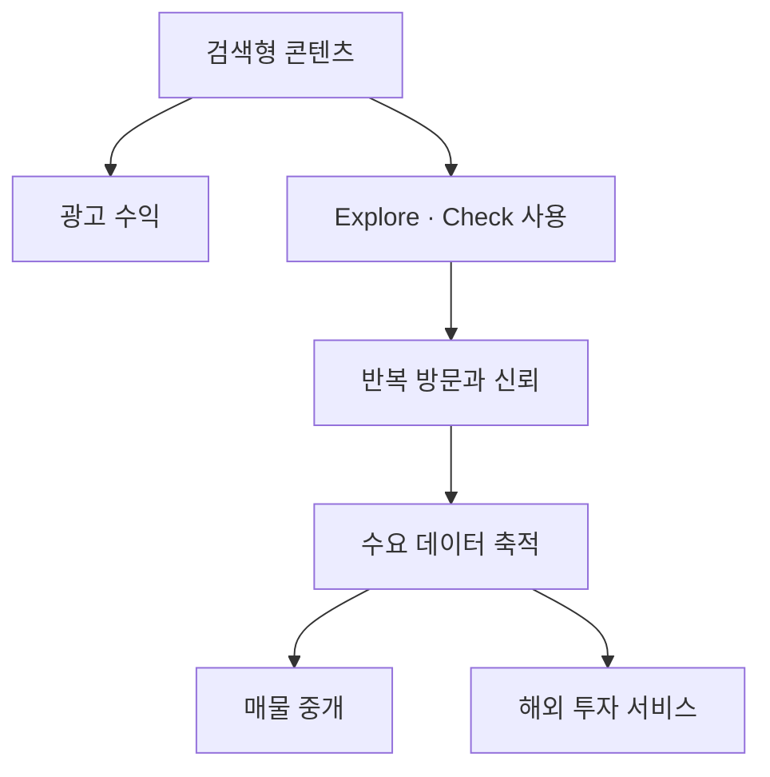

# SignedPrice 광고 기반 성장·에디토리얼 UI 개편 설계

**작성일:** 2026-09-04

**상태:** 사용자 검토 대기

**적용 범위:** 사업 우선순위, 정보 구조, 영문·중문 콘텐츠, 광고 원칙, 핵심 화면 구성, UI 품질 기준

**변경 관계:** 2026-08-31 및 2026-09-02 설계의 데이터 무결성·시장별 증거 원칙은 유지하되, 초기 성장 순서와 화면 우선순위를 이 문서로 교체한다.

## 1. 제품과 사업의 새 출발점

SignedPrice의 장기 목표는 **검증 가능한 데이터를 기반으로 한 부동산 매물 중개 및 해외 부동산 투자 사업**이다. 그러나 현재 단계에서 중개 파트너와 투자 고객을 바로 확보하려 하면 낮은 브랜드 인지도, 부족한 반복 방문, 제한된 사례와 거래 실적 때문에 영업비용이 지나치게 커진다.

따라서 첫 사업 모델은 다음과 같이 고정한다.

> 지금은 부동산 데이터 도구를 가진 전문 미디어로 트래픽과 신뢰를 만들고 광고 수익을 낸다. 이후 축적된 검색 수요·행동 데이터·브랜드 신뢰를 매물 중개와 해외 투자 서비스로 전환한다.

초기 핵심 사용자는 **한국에서 거주하거나 임차·매수를 검토하는 영어권 사용자**다. 중국어는 한국 부동산·생활 정보를 찾는 중국어 사용자를 위한 두 번째 콘텐츠 언어로 시작한다. 중국 본토 부동산 시장 데이터는 별도의 후속 사업 단계다.

## 2. 이번 개편의 성공 조건

이번 개편은 기능 수를 늘리는 프로젝트가 아니다. 다음 네 가지가 동시에 성립해야 성공이다.

1. 검색 방문자가 5초 안에 사이트의 전문 분야와 다음 행동을 이해한다.
2. Guides와 Insights가 광고를 붙일 수 있는 충분한 품질과 체류 구조를 갖는다.
3. Check와 Explore가 콘텐츠의 주장을 검증하는 도구로 연결된다.
4. 화면이 템플릿 조합이나 AI 생성물처럼 보이지 않고, 편집 원칙을 가진 독립 브랜드로 인식된다.

첫 출시에서 중개 문의 수, 투자 문의 수, 파트너 수를 핵심 지표로 삼지 않는다. 우선 지표는 검색 유입, 광고 가능 세션, 콘텐츠 완독, 내부 이동, Check·Explore 진입률이다.

## 3. 현재 상태에 대한 객관적 진단

현재 구현은 반응형 페이지와 컴포넌트가 존재한다는 의미에서는 작동하지만, 시각 편집과 정보 위계가 충분히 설계되지 않았다.

### 3.1 사업·정보 구조 문제

- `Markets`, `Prices`, `Properties`, `News`, `Community`, `Guides`, `Invest`가 한꺼번에 노출되어 실제 역량보다 사업 범위가 넓어 보인다.
- 비어 있거나 준비 중인 `Properties`, `Invest`, `Community`는 확장 가능성을 보여주기보다 현재 신뢰를 깎는다.
- 홈페이지에서 데이터 도구, 뉴스, 커뮤니티, 시장 확장, 투자 메시지가 경쟁한다.
- 서울과 싱가포르 화면의 구성 문법이 다르고, 데이터가 많을수록 페이지가 길고 복잡해진다.
- News의 분류 품질이 고르지 않아 검색 유입을 얻더라도 전문 매체로서의 신뢰가 약하다.

### 3.2 UI 구현 문제

- 지나치게 작은 8–12px 텍스트가 데이터 행과 보조 설명에 사용된다.
- 대문자 레이블에 넓은 자간을 반복하고, 제목에는 강한 음수 자간을 일괄 적용한다.
- 0px부터 999px까지 임의의 모서리 반경이 섞여 화면 문법이 일관되지 않다.
- 카드, 칩, 배지, 테두리, 구분선이 정보의 중요도와 관계없이 반복된다.
- 큰 영웅 제목과 작은 본문 사이의 비율이 과장되어 실제 콘텐츠보다 레이아웃이 먼저 보인다.
- 하나의 화면에 가로 필터, 지도, 표, 통계, 배지, 설명을 모두 넣어 시선의 시작점이 불명확하다.
- 로딩·빈 상태·동의 배너가 본 콘텐츠보다 더 큰 면적을 차지하는 경우가 있다.

이 문제는 색상을 바꾸거나 컴포넌트를 정리하는 정도로 해결되지 않는다. **타이포그래피, 그리드, 페이지별 편집 우선순위, 상태 화면까지 하나의 계약으로 고정**해야 한다.

## 4. 브랜드와 시각 방향

시각 방향은 **에디토리얼 프로프테크(editorial proptech)**다. 신문처럼 읽기 쉽고, 전문 데이터 제품처럼 정확해야 한다. 일반 SaaS 대시보드, 부동산 포털의 매물 카드 벽, AI 랜딩페이지 중 어느 쪽도 모방하지 않는다.

### 4.1 원칙

- 한 화면에는 하나의 지배적인 사용자 과업만 둔다.
- 위계는 카드 수가 아니라 글자 크기, 여백, 정렬, 콘텐츠 순서로 만든다.
- 핵심 데이터는 장식하지 않고 출처·기간·표본과 함께 차분하게 보여준다.
- 본문과 도구는 시각적으로 연결하되 광고는 명확하게 분리한다.
- 실제 콘텐츠가 준비되기 전에는 빈 메뉴와 가상의 수치로 확장성을 연출하지 않는다.
- 사진은 의미 있는 현장성이나 지역 맥락이 있을 때만 사용한다. 일반적인 고층 건물 스톡 사진을 기본 장식으로 사용하지 않는다.

### 4.2 금지하는 ‘AI 생성형 UI’ 패턴

다음 패턴은 구현 검수에서 결함으로 취급한다.

- 그라데이션 영웅 영역, 유리 효과, 빛나는 블러, 의미 없는 추상 배경
- 모든 문단을 별도 카드에 넣는 구성
- 세 개의 같은 크기 카드로 무조건 시작하는 섹션
- 비상호작용 텍스트를 모두 알약형 배지로 만드는 방식
- 의미 없이 반복되는 대문자 마이크로카피와 넓은 자간
- 출처 없는 대형 통계, 허구의 사용자 수, 가짜 후기와 로고 벽
- 과도한 둥근 모서리, 떠 있는 패널, 여러 단계의 중첩 그림자
- 국기 이모지를 시장 전환의 핵심 UI로 사용하는 방식
- “evidence-first”, “make smarter decisions” 같은 추상 문구의 반복
- 실제 데이터가 없는데도 완성된 것처럼 보이게 하는 지도 핀·차트·매물 이미지

### 4.3 글로벌 부동산 레퍼런스 체계

SignedPrice는 한 사이트의 외형을 복제하지 않는다. 서로 다른 사업 모델에서 검증된 패턴을 **화면의 역할별로 분해해 차용**한다. 이를 통해 한 브랜드를 흉내 내는 문제와 여러 스타일이 뒤섞이는 문제를 동시에 피한다.

| 레퍼런스 | 관찰할 강점 | SignedPrice 적용 영역 | 그대로 가져오지 않을 것 |
| --- | --- | --- | --- |
| [Rightmove](https://www.rightmove.co.uk/) | 첫 화면에서 Buy·Rent·Sold 중 과업을 고르고 바로 검색하는 명료한 진입 | 홈페이지 주 행동, 거래 유형 전환, Check 시작 화면 | 방대한 하위 메뉴와 영국 시장 전용 분류 |
| [Zillow](https://www.zillow.com/homes/for_sale/) | 지도·목록·필터·선택 상태가 하나의 탐색 흐름으로 이어지는 방식 | Seoul Explore의 데스크톱 지도/레일 동기화 | 광고성 배지, 매물 카드 과밀, Zestimate와 유사한 근거 없는 단일 추정값 |
| [Redfin](https://www.redfin.com/news/data-center/) | 지역 시장 페이지, 주기적 데이터 갱신, 데이터 다운로드와 방법론의 연결 | Insights, 지역 페이지, 갱신일·방법론·데이터 탐색 | 미국 MLS 문법과 중개 전환을 초기 화면에 강하게 노출하는 방식 |
| [Realtor.com Research](https://www.realtor.com/research/) | 국가 요약 지표와 최신 분석을 한 리서치 허브에서 연결 | Insights 홈의 핵심 지표와 편집 목록 | 메인 지표를 출처·표본 없이 마케팅 숫자로 사용하는 방식 |
| [Domain Research](https://www.domain.com.au/research/) | House prices·Rental·Liveability 등 독자 질문 중심의 리서치 분류 | Guides와 Insights의 주제 체계, 지역 리포트 | 호주식 주거 유형·학교권 분류의 기계적 이식 |
| [PropertyGuru Singapore](https://www.propertyguru.com.sg/) | HDB·Condo·Landed와 MRT·학교 등 싱가포르 고유 탐색 언어 | Singapore 어댑터의 검색어·필터·지역 맥락 | 메가 메뉴, 하단 SEO 링크 벽, 준비되지 않은 Agent·Community 기능 |
| [99.co Singapore](https://www.99.co/) | 매물 검색에서 가치 계산기·프로젝트 데이터·콘텐츠로 이어지는 구조 | 장기적으로 Explore→Check→Insights를 연결하는 제품 흐름 | 한 화면에 프로젝트·키워드·영상·뉴스·매물을 모두 노출하는 과밀 구성 |
| [The Modern House](https://themodernhouse.com/journal) | 중개와 저널을 하나의 편집 철학으로 연결하는 타이포그래피·사진·서술 | 아티클, 향후 선별 매물, 브랜드의 편집감 | 이미지가 없는 데이터 화면까지 사진 중심으로 만드는 방식 |
| [Compass](https://www.compass.com/) | 지역 검색에서 에이전트와 실제 서비스로 자연스럽게 연결되는 구조 | Phase 5 중개 파트너·지역 전문가 연결 | 신뢰가 쌓이기 전에 에이전트 CTA와 후기를 전면 노출하는 방식 |
| [JLL Insights](https://www.jll.com/en-us/insights) | 리서치 주제·시장·전문가를 연결하는 기관형 정보 구조 | 해외 투자 Insights, 작성·검수 주체, 전문가 프로필 | 상업용 부동산 중심의 복잡한 서비스 분류와 기업 홍보 문구 |
| [Savills Research](https://www.savills.com/research_articles/255800/389530-0) | 시장 보고서의 기준 시점, 지역, 분야, 관련 연구 연결 | 분기·월간 시장 리포트 템플릿 | PDF 보고서 중심의 무거운 탐색 경험 |
| [Knight Frank Research](https://www.knightfrank.com/research) | 도시·섹터·글로벌 리포트를 묶는 리서치 라이브러리 | 향후 다국가 투자 리서치 허브 | 고가 주택 이미지와 전망 수치를 일반 임차 서비스에 혼용하는 방식 |
| [Sotheby's International Realty](https://www.sothebysrealty.com/eng) | 국가 간 고급 매물 탐색과 일관된 국제 브랜드 표현 | Phase 6 해외 매물·투자 서비스의 국가 탐색 | 럭셔리 이미지 중심의 과장된 초기 브랜딩 |
| [idealista](https://www.idealista.com/en/) | 매물 검색·가격 리포트·지도·다국어 해외 구매 정보를 한 생태계로 연결 | 장기적인 시장/언어 분리와 해외 구매 가이드 | 방대한 기능을 초기 내비게이션에 미리 노출하는 방식 |

이 목록은 시각 취향을 정당화하기 위한 로고 모음이 아니다. 각 화면군은 아래 절차를 통과한다.

1. 구현 전에 해당 역할과 관련된 레퍼런스를 최소 3개 선택한다.
2. 각 레퍼런스에서 차용할 원칙을 하나씩만 기록한다.
3. SignedPrice의 실제 영문·중문 콘텐츠와 실제 데이터로 구조를 다시 설계한다.
4. 색상·글꼴·아이콘·문구·컴포넌트 외형을 그대로 복제하지 않는다.
5. 구현 후 원본과 나란히 비교하는 것이 아니라, SignedPrice 타이포그래피·그리드 계약과 사용자 과업으로 검수한다.

화면별 기본 조합은 다음과 같다.

| SignedPrice 화면 | 1차 레퍼런스 조합 |
| --- | --- |
| Homepage | Rightmove의 단일 과업 + The Modern House의 편집감 + Redfin의 데이터 신뢰 |
| Guides / Article | The Modern House의 읽기 경험 + JLL·Savills의 작성·검수·관련 연구 구조 |
| Insights / Market page | Redfin Data Center + Realtor.com Research + Domain Research |
| Seoul Explore | Zillow의 지도/목록 상태 + Rightmove의 필터 우선순위 |
| Singapore Explore | PropertyGuru의 시장 용어 + 99.co의 도구 연결 + SignedPrice의 동일 그리드 |
| Check | Rightmove의 빠른 진입 + Redfin의 결과 설명 + SignedPrice의 증거 계약 |
| Future brokerage | Compass의 지역 전문가 연결 + The Modern House의 선별된 매물 편집 |
| Future overseas investment | JLL·Savills·Knight Frank의 리서치 체계 + Sotheby's의 국가 탐색 |

## 5. 타이포그래피 계약

타이포그래피는 구현자의 감각에 맡기지 않고 토큰으로 제한한다. 글꼴은 실제 라이선스와 로딩 성능을 확인한 뒤 Latin과 CJK 각각 하나의 sans 계열을 선택한다. 최종 글꼴이 확정되기 전에도 아래 크기·행간·자간 계약은 지킨다.

| 용도 | Desktop | Mobile | 행간 | 자간 | 제한 |
| --- | ---: | ---: | ---: | ---: | --- |
| Display/H1 | 56px | 40px | 1.06 | `-0.025em` | 한 화면 최대 1개, 3줄 이하 |
| H2 | 36px | 30px | 1.15 | `-0.015em` | 섹션 제목 |
| H3 | 24px | 22px | 1.25 | `-0.01em` | 카드가 아닌 실제 소제목 |
| Lead | 20px | 18px | 1.55 | `0` | 최대 60ch |
| Article body | 18px | 17px | 1.72 | `0` | 62–70ch |
| UI body | 16px | 16px | 1.55 | `0` | 폼·결과·설명 |
| Control | 14px | 14px | 1.4 | `0` | 버튼·탭, 최소 높이 44px |
| Metadata | 12px | 12px | 1.45 | `0.01em` | 이보다 작게 금지 |
| Kicker | 12px | 12px | 1.35 | `0.04em` 이하 | 영문 1–3단어만 선택적 대문자 |

추가 규칙:

- 한국어와 중국어는 음수 자간을 기본 적용하지 않는다. 제목도 `0`에서 시작하고 시각 검수 후 최대 `-0.01em`까지만 허용한다.
- CJK 본문 행간은 최소 `1.65`, 긴 글은 `1.75`를 기준으로 한다.
- 영문 본문은 자동 하이픈을 사용하지 않으며 고유명사와 금액이 어색하게 분리되지 않게 검수한다.
- 탭, 표, 버튼, 필터에서 12px 미만 글자를 금지한다. 상호작용 레이블은 14px 이상이다.
- 숫자 비교 표에서만 tabular numerals를 사용한다. 모든 제목에 숫자용 스타일을 섞지 않는다.
- 한 화면에서 본문 굵기는 Regular, Medium, Semibold 세 단계만 사용한다. Bold 남용을 금지한다.
- 임의의 `font-size`, `line-height`, `letter-spacing` 선언을 금지하고 토큰 예외는 코드 리뷰 사유를 남긴다.

## 6. 그리드·간격·표면 계약

### 6.1 레이아웃

| 항목 | Desktop | Tablet | Mobile |
| --- | --- | --- | --- |
| 기준 뷰포트 | 1440px | 1024px | 390px |
| 일반 콘텐츠 최대 폭 | 1200px | 유동 | 유동 |
| 데이터 작업 화면 최대 폭 | 1440px | 유동 | 유동 |
| 아티클 본문 폭 | 680–720px | 680px 이하 | 전체 폭 |
| 페이지 좌우 여백 | 40px | 24px | 16px |
| 그리드 | 12열 | 8열 | 4열 |
| 열 간격 | 24px | 20px | 16px |

- 기본 간격은 4px 단위를 쓰되 실제 구성 간격은 주로 8, 12, 16, 24, 32, 48, 64, 96px만 사용한다.
- 일반 페이지의 섹션 간격은 Desktop 80–96px, Mobile 56–64px다.
- 한 섹션 내부에서 중첩된 컨테이너는 최대 2단계로 제한한다.
- 모서리 반경은 `0`, `8px`, `12px` 세 종류만 허용한다. 알약형은 토글·필터 칩처럼 기능상 필요한 제어에만 사용한다.
- 그림자는 떠 있어야 하는 메뉴·모달에만 사용한다. 일반 카드 구분에는 배경 대비와 1px 선을 사용한다.
- 강조색은 행동용 cobalt 한 가지를 기본으로 하고, 성공·경고·위험 색은 상태 전달에만 쓴다.

### 6.2 화면 밀도

- 첫 화면에는 제목, 한 문단 설명, 주 행동 하나, 보조 행동 최대 하나만 둔다.
- 동일 계층에서 강조 요소는 최대 세 개다.
- 필터가 5개를 넘으면 모두 펼쳐 놓지 않고 중요도에 따라 기본·추가 필터로 나눈다.
- 데이터 표는 모바일에서 억지로 축소하지 않는다. 우선순위 열만 남기고 나머지는 상세 패널로 이동한다.
- 긴 설명과 면책 문구는 핵심 결과 이후에 배치하되 접근 가능하게 유지한다.

## 7. 정보 구조

초기 글로벌 내비게이션은 네 항목으로 제한한다.

| 항목 | 역할 | 초기 수익/신뢰 기여 |
| --- | --- | --- |
| Explore | 지역·건물·실거래 탐색 | 데이터 전문성 증명 |
| Check | 제시 가격 또는 계약 조건 검토 | 반복 사용과 전환 의도 파악 |
| Insights | 데이터 기반 시장 분석 | 검색·공유·광고 |
| Guides | 장기 검색형 실용 콘텐츠 | 검색·광고·도구 연결 |

시장 전환기와 언어 전환기는 내비게이션 항목과 분리한다. `Properties`, `Invest`, `Community`는 실제 서비스와 운영 체계가 준비되기 전까지 주 내비게이션에서 숨긴다. `News`는 자동 수집 피드가 아니라 검수된 Brief만 남기고, 품질이 확보되기 전에는 `Insights` 안의 보조 형식으로 취급한다.

언어와 시장은 서로 다른 축이다.

| 언어 | 서울 시장 예시 | 향후 중국 시장 예시 |
| --- | --- | --- |
| English | `/kr/seoul/` | `/cn/shanghai/` |
| 한국어 | `/ko/kr/seoul/` | `/ko/cn/shanghai/` |
| 简体中文 | `/zh-cn/kr/seoul/` | `/zh-cn/cn/shanghai/` |

중국어 URL이 곧 중국 시장을 뜻하지 않는다. 초기 중국어 콘텐츠는 한국 시장을 다룬다.

## 8. 핵심 화면 구성

### 8.1 홈페이지

홈페이지는 최대 다섯 구역으로 고정한다.

1. **명확한 한 문장 약속**: 한국 주거비와 계약을 실제 데이터로 이해한다.
2. **대표 행동**: `Check a price`를 1차, `Explore Seoul`을 2차 행동으로 둔다.
3. **이번 주 핵심 분석**: 대표 Insights 한 편과 근거 수치.
4. **실용 Guides**: 사용자 여정별 3–5편. 카드 벽 대신 편집 목록을 쓴다.
5. **방법론과 출처**: 데이터 기간, 출처, 갱신 상태를 간결하게 설명한다.

시장 준비 중 섹션, 가짜 인기 순위, 빈 파트너 로고, 과장된 서비스 예고를 넣지 않는다.

### 8.2 콘텐츠 인덱스

- 상단에는 제목과 짧은 편집 설명만 둔다.
- 최신순 무한 목록 대신 `Renting`, `Buying`, `Neighborhoods`, `Market data`의 실제 사용자 과업으로 분류한다.
- 대표 글 1개, 최신·필수 글 목록, 시장별 필터로 구성한다.
- 썸네일이 정보 가치를 높이지 않으면 텍스트 중심 목록을 사용한다.
- 각 항목에는 읽는 시간보다 대상 독자, 업데이트 날짜, 연결된 도구를 우선 표시한다.

### 8.3 아티클

- 제목, 리드, 업데이트 날짜, 작성·검수 주체, 대상 시장, 핵심 요약을 첫 화면에 제공한다.
- 본문은 62–70ch로 제한하고 표·차트만 필요할 때 본문 폭을 벗어난다.
- 핵심 주장 옆에 출처와 기준 시점을 배치한다.
- 관련 Check·Explore 진입은 글의 결론과 자연스럽게 연결한다.
- 광고는 본문 흐름을 끊지 않도록 예약된 슬롯에만 표시한다.
- 자동 번역 흔적, 반복 문장, 지역명 치환형 문서를 허용하지 않는다.

### 8.4 Check

- 첫 화면의 중심은 하나의 가격·계약 검토다. 입력은 사용 순서대로 한 열에 놓는다.
- 결과는 verdict, 비교 기준, 금액 차이, 표본·기간, 최근 비교 사례 순서로 읽힌다.
- A/B 계약 비교는 보조 도구로 유지하고 주 흐름과 경쟁시키지 않는다.
- 데이터가 부족하면 억지 verdict를 만들지 않고 비교 가능한 더 넓은 범위를 제시한다.
- 광고를 결과, 입력 폼, 비교 사례 사이에 넣지 않는다.

### 8.5 Explore

- Desktop은 420px 결과·필터 레일과 나머지 지도 영역의 두 패널을 기본으로 한다.
- 검색, 거래 유형, 주거 유형, 가격대만 기본 필터로 노출하고 나머지는 `More filters`에 둔다.
- 선택, URL, 지도 핀, 결과 목록은 항상 동기화한다.
- Tablet의 레일은 360px, Mobile은 `List / Map` 전환으로 분리한다.
- 외부 지도 동의가 없더라도 결과 목록과 핵심 증거는 작동해야 한다.
- 지도 빈 상태는 회색 사각형으로 방치하지 않고 이유와 가능한 다음 행동을 표시한다.

### 8.6 Building Detail

- 건물 신원, 위치, 거래 유형별 근거, 최근 거래, 출처를 한 페이지에서 이해할 수 있게 한다.
- 사진이나 Street View는 검증된 건물 이미지가 아니라면 `Nearby street view`로 명확히 표시한다.
- 주요 수치 3–4개만 상단에 두고 나머지는 거래·건물·지역 섹션으로 나눈다.
- 다른 건물과의 비교나 Check 진입을 주 행동으로 둔다.

## 9. 광고 UX와 수익 원칙

광고는 사이트를 유지하기 위한 초기 수익원이며, 데이터 판단을 왜곡하지 않는 범위에서만 배치한다.

### 9.1 허용 위치

- Guides 및 Insights 인덱스의 목록 사이
- 긴 아티클의 첫 번째 의미 있는 본문 이후, 중간, 본문 종료 후
- 검수된 News Brief의 본문 영역

### 9.2 금지 위치

- Check의 입력과 결과
- Explore 지도, 필터, 결과 행 사이
- Building Detail의 핵심 가격·거래 증거 사이
- 데이터 출처·면책·오류 메시지와 혼동되는 위치
- 모바일 하단을 지속해서 가리는 고정 광고

### 9.3 표시 계약

- 모든 광고는 `Advertisement`로 표시한다.
- 슬롯 높이를 미리 예약해 누적 레이아웃 이동을 방지한다.
- 첫 의미 있는 문단보다 앞에 본문 광고를 넣지 않는다.
- 초기 긴 글 한 편당 본문 광고는 최대 3개다.
- 광고가 로드되지 않아도 빈 회색 상자나 과도한 공백을 남기지 않는다.
- 제휴·스폰서 콘텐츠는 일반 편집 글과 라벨·작성 주체·검수 과정에서 분리한다.

### 9.4 수익 측정

초기 광고 네트워크는 콘텐츠·정책·동의·트래픽 요건을 충족한 뒤 신청한다. 승인이나 특정 수익을 전제로 개발 일정을 잡지 않는다. 실제 유입 데이터가 생기기 전에는 임의의 RPM으로 매출을 약속하지 않고, 다음 지표를 페이지 유형과 언어별로 본다.

- 광고 가능 세션과 페이지 RPM
- 광고 viewability와 fill rate
- 광고 전후의 완독률·이탈률·Core Web Vitals
- 아티클에서 Check·Explore로 이동한 비율
- 재방문과 검색 유입 중 비브랜드 검색 비중

광고 수익이 늘더라도 완독률, 내부 도구 진입, 레이아웃 안정성이 악화되면 해당 위치를 축소하거나 제거한다.

## 10. 영문·중문 콘텐츠 전략

초기 제작 비중은 **영문 70%, 간체중문 30%**를 기준으로 한다. 한국어는 데이터 화면과 핵심 정책 페이지의 품질을 유지하되, 대규모 콘텐츠 생산의 우선순위는 아니다.

### 10.1 영문 초기 주제군

- 한국 임대 계약: jeonse, wolse, deposit, maintenance fee
- 외국인의 계약 위험과 확인 절차
- 서울 지역별 실제 임대비 비교
- 한국에서 집을 찾는 전체 여정
- 데이터로 읽는 월별·분기별 시장 변화

초기 목표는 얕은 글 수백 개가 아니라 **검색 의도와 도구 연결이 명확한 30–40개의 영문 원문**이다.

### 10.2 중국어 초기 주제군

- 在韩国租房的合同与押金结构
- 全租、月租与管理费의 정확한 설명
- 首尔区域별 임대비와 생활권 비교
- 유학생·직장인·가족의 계약 체크리스트
- 한국 실거래 데이터의 읽는 법

먼저 10–15개 글을 독립 편집·검수하여 반응을 확인한다. 영문 글을 일괄 번역해 수를 늘리지 않는다. 중국어 사용자는 한국·싱가포르·홍콩·대만·북미 등 여러 검색 환경에 있으므로 초기에는 중국 본토 검색 유입만을 전제로 사업성을 계산하지 않는다.

### 10.3 콘텐츠 품질 계약

모든 글은 다음을 갖춘다.

- 명확한 대상 독자와 검색 의도
- 원문 작성일과 최종 업데이트일
- 작성자 또는 편집 책임
- 법·세금·시장 수치의 기준일과 출처
- 핵심 질문에 대한 직접 답변
- 관련 Check, Explore, Glossary 또는 다른 글로의 내부 연결
- 영문과 중문 각각의 원어민 수준 편집 검수

지역명과 숫자만 바꾼 대량 페이지, 자동 생성된 FAQ, 출처 없는 투자 추천은 만들지 않는다.

## 11. 상태·접근성·개인정보

- 콘텐츠와 핵심 가격 근거는 분석 쿠키 동의 없이도 볼 수 있어야 한다.
- 외부 지도·Street View 동의는 분석·광고 동의와 분리한다.
- 개인정보 배너가 화면 절반을 가리지 않도록 짧은 1차 선택과 상세 설정을 분리한다.
- loading, empty, error, stale, rights-blocked, insufficient-sample 상태를 각각 설계한다.
- 클릭·터치 대상은 최소 44×44 CSS px, 키보드 초점은 항상 보인다.
- 색만으로 가격 상태나 위험도를 구분하지 않는다.
- 언어 전환 후 같은 시장·같은 페이지 맥락을 최대한 유지한다.
- 주소, 입력 가격, 계약 금액을 분석 이벤트나 광고 네트워크에 보내지 않는다.

## 12. 설계와 구현 절차

이번 개편부터 설명문만 보고 바로 전체 페이지를 구현하지 않는다.

### Gate A — 기준 화면 설계

먼저 아래 네 화면군을 실제 콘텐츠로 설계한다.

1. 홈페이지
2. 콘텐츠 허브와 대표 아티클
3. Check 입력과 결과
4. Seoul Explore와 선택된 건물 요약

Building Detail은 위 네 화면군에서 확정된 타이포그래피·증거 행·상태 문법을 재사용해 Phase 2에서 설계한다. 각 기준 화면군은 1440px, 1024px, 390px에서 만든다. 광고 로드·미로드, 영문·중문, 긴 제목, 데이터 부족, 오류 상태까지 포함한다.

### Gate B — 사용자 승인

이미지나 브라우저 프리뷰로 다음을 확인한다.

- 글자 크기·자간·행간
- 첫 시선과 주요 행동
- 화면 밀도와 여백
- 실제 콘텐츠에서의 신뢰감
- 모바일 구성

승인 전에는 나머지 페이지로 스타일을 확장하지 않는다.

### Gate C — 토큰과 공통 뼈대

승인된 화면에서 글자, 간격, 폭, 색상, 반경, 선, 상태 토큰을 추출한다. Header, Footer, article typography, form control, evidence row, ad slot만 우선 공통화한다. 추상화는 실제로 두 곳 이상에서 동일하게 쓰일 때만 한다.

### Gate D — 화면별 구현과 검수

한 번에 한 화면군을 구현하고 다음 화면으로 넘어가기 전에 브라우저에서 검수한다. CSS가 빌드된다는 사실을 시각 품질 통과로 취급하지 않는다.

## 13. 시각 품질 검수표

다음 항목은 모든 주요 화면의 완료 조건이다.

### 13.1 자동 검수

- 임의의 글자 크기·행간·자간·반경 값이 토큰 외에 추가되지 않는다.
- 1440, 1024, 390px에서 수평 스크롤이 없다.
- Core Web Vitals 기준에 맞게 이미지와 광고 영역을 예약한다.
- 제목, 버튼, 폼 레이블, 오류가 접근성 트리에서 올바르게 연결된다.
- 영문·중문·한국어 긴 문자열 테스트를 통과한다.
- 주요 화면 스크린샷 회귀 테스트가 존재한다.

### 13.2 사람의 눈으로 하는 검수

- 5초 안에 페이지의 목적과 첫 행동을 말할 수 있다.
- 첫 화면의 1차 행동은 정확히 하나다.
- 본문 줄 길이와 행간이 실제 5분 이상 읽기에 편하다.
- 카드·배지·테두리를 하나씩 지워도 위계가 유지되는지 확인한다.
- 데이터의 출처·기간·표본이 장식보다 먼저 이해된다.
- 로딩·오류·동의 UI가 정상 콘텐츠보다 시각적으로 강하지 않다.
- 화면을 구성하는 컨테이너가 세 단계 이상 중첩되지 않는다.
- 모바일이 데스크톱의 축소판이 아니라 우선순위를 다시 편집한 화면이다.
- 실제 사용자 문장과 실제 데이터로 보고도 어색하지 않다.
- 최종 사용자가 “AI가 만든 흔한 화면 같다”고 느끼면 완료로 처리하지 않는다.

## 14. 단계별 로드맵

### Phase 0 — 편집·UI 기준 확정

- 화면군별 레퍼런스 3개 이상을 캡처·분석하고 차용 원칙과 배제 원칙을 기록한 reference dossier 작성
- 위 네 개 기준 화면군 설계
- 타이포그래피와 그리드 토큰 확정
- EN/zh-CN 실제 콘텐츠 샘플 적용
- 광고 슬롯 포함 시각 검수

**종료 조건:** 1440·1024·390 화면을 사용자가 직접 승인한다.

### Phase 1 — 광고 가능한 미디어 기반

- 글로벌 내비게이션 단순화
- 홈페이지 개편
- Guides·Insights 인덱스와 아티클 템플릿
- 광고 슬롯, `ads.txt`, 동의 처리, 작성·검수 정보, 업데이트·출처 체계
- 기존 저품질 News 분류 정리

**종료 조건:** 영문 핵심 콘텐츠가 검색 유입과 내부 이동을 만들 수 있고 광고가 읽기를 훼손하지 않는다.

### Phase 2 — 도구와 콘텐츠 연결

- Check 입력·결과 재설계
- Seoul Explore 재설계 후 같은 문법으로 Building Detail 설계
- 아티클 문맥에서 해당 지역·가격 도구로 연결
- 개인정보·지도 동의 구조 축소

**종료 조건:** 콘텐츠 방문자가 근거 도구로 이동하고, 도구 사용자가 관련 설명을 읽을 수 있다.

### Phase 3 — 중국어 한국 부동산 콘텐츠

- 간체중문 IA와 편집 기준
- 10–15개 독립 원문 수준의 파일럿
- 시장/언어 전환과 hreflang
- 중문 타이포그래피·줄바꿈·검색 스니펫 검수

**종료 조건:** 단순 번역 페이지가 아닌 중국어 사용자용 한국 부동산 채널로 평가할 수 있다.

### Phase 4 — 광고 최적화와 반복 성장

- 광고 위치별 수익, 이탈, 완독 영향 측정
- 상위 콘텐츠 갱신과 관련 글 구조 개선
- 뉴스레터나 알림은 반복 방문 근거가 생긴 뒤 검토
- 싱가포르 콘텐츠와 도구는 데이터·편집 품질이 서울 기준을 통과한 뒤 확대

**종료 조건:** 광고가 실제 운영비에 기여하고 콘텐츠 품질을 해치지 않는 범위가 측정된다.

### Phase 5 — 중개 수요 검증

- 반복되는 지역·가격·계약 질문을 비식별 수요 데이터로 분석
- 검증된 파트너 기준, 책임 범위, 리드 처리 체계 수립
- 제한된 지역과 거래 유형에서 상담 또는 중개 파일럿
- 광고 콘텐츠와 중개 이해관계를 명확히 분리

### Phase 6 — 해외 투자와 중국 시장

- 국가별 규제, 라이선스, 세금, 송금, 광고·자문 책임 검토
- 싱가포르·두바이 등 검증된 데이터 시장부터 투자 의사결정 제품 확장
- 중국 본토 시장은 별도 데이터 권리, 배포·검색 환경, 현지 규정 검토 후 독립 진입

## 15. 이번 범위에서 하지 않는 것

- 신뢰와 운영 체계 없이 중개 파트너 모집 페이지를 전면 노출하지 않는다.
- 매물 데이터가 없는데 `Properties` 메뉴를 유지하지 않는다.
- 투자 자문·수익률 추천·리드 판매를 초기 광고 모델과 섞지 않는다.
- 중국어 콘텐츠 출시와 중국 본토 부동산 시장 진입을 같은 프로젝트로 취급하지 않는다.
- 대량 자동 번역, 자동 생성 지역 페이지, 허구의 통계와 후기를 사용하지 않는다.
- 디자인 승인을 받기 전 전체 코드베이스에 새 스타일을 일괄 적용하지 않는다.

## 16. 확정된 결정과 사용자 검토 항목

### 확정된 결정

- 초기 수익 모델은 콘텐츠 광고다.
- 초기 주 사용자는 한국 부동산에 관심 있는 영어권 사용자다.
- 중국어는 한국 부동산 콘텐츠부터 시작하고, 중국 시장은 후속 단계다.
- 장기 사업은 중개와 해외 부동산 투자로 확장한다.
- 광고는 콘텐츠 화면에만 배치하고 핵심 판단 도구에는 넣지 않는다.
- UI 구현 전에 네 개 기준 화면군과 세 개 뷰포트를 승인받는다.

### 이번 검토에서 확인할 항목

1. `에디토리얼 프로프테크`를 최종 시각 방향으로 고정할지
2. 타이포그래피와 레이아웃 수치가 원하는 밀도에 맞는지
3. 주 내비게이션을 `Explore / Check / Insights / Guides`로 줄일지
4. 콘텐츠 70:30과 광고 배치 원칙을 그대로 적용할지
5. Phase 0 승인 후에만 실제 구현 계획을 작성할지
