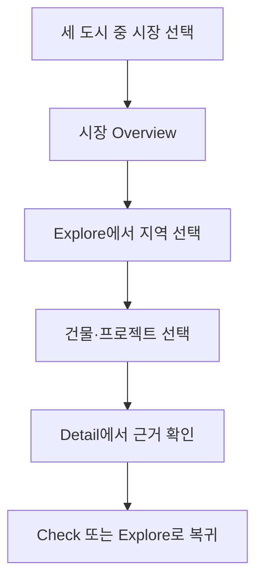

# SignedPrice 운영 화면 일관성·데이터 준비도 개선 설계

**작성일:** 2026-09-04

**상태:** 화면·제품 방향 사용자 승인 완료, 문서 검토 대기

**적용 범위:** 공통 내비게이션, 글로벌 홈페이지, Seoul·Singapore Overview와 Explore, 건물 미디어, 공개 조회 성능, 시각·상호작용 검수
**제외 범위:** Dubai 원천 데이터 수집, AdSense 신청·광고 송출, 중개·투자 문의 기능

**변경 관계:**

- `2026-09-04-signedprice-editorial-growth-ui-design.md`의 색상·타이포그래피·광고·콘텐츠 원칙을 유지한다.
- `2026-09-04-signedprice-three-market-experience-data-model-design.md`의 세 도시 약속, 공통 코어, 미디어 권리, capability 모델을 유지한다.
- 이 문서는 2026-09-04 운영 Preview 검수에서 드러난 헤더 분리, 정렬 불일치, 지도 좌표 부재, 사진 조회 실패, Singapore 전환 지연을 AdSense 이전 출시 차단 조건으로 구체화한다.

## 1. 제품 판단

이번 작업의 우선순위는 새 기능 추가가 아니라 **이미 존재하는 기능을 한 제품처럼 연결하고, 사용자가 기다리거나 길을 잃는 지점을 제거하는 것**이다.

SignedPrice의 첫 화면은 서울 단일 서비스처럼 보이면 안 된다. 서울·싱가포르·두바이를 모두 다루는다는 약속을 분명히 보여주되, 각 시장의 데이터 준비도를 동일한 것처럼 과장하지 않는다. 시장에 들어간 뒤에는 사용자가 다음 흐름을 끊김 없이 수행할 수 있어야 한다.

성공 기준은 화면이 예뻐 보이는 것만이 아니다. 다음이 함께 성립해야 한다.

1. 모든 공개 페이지가 같은 브랜드·내비게이션 문법을 사용한다.
2. 서울과 싱가포르의 지역·건물·근거 데이터가 화면 상태와 동기화된다.
3. 사진과 지도는 사용 시점에 외부 조회를 시작하는 부가 기능이 아니라, 준비된 공개 데이터에서 즉시 읽힌다.
4. 데이터가 없거나 지연될 때도 클릭 반응과 다음 행동이 즉시 보인다.
5. 기존 네이비·블루·화이트 색상은 유지하며, 자간·행간·정렬·밀도를 다시 설계한다.

## 2. 운영 화면 감사 결과

### 2.1 공통 구조

- 글로벌 홈은 `EditorialGrowthPublicShell`, 시장·도구 화면은 `SiteHeader`를 사용해 헤더 높이, 메뉴 순서, 정렬 기준이 다르다.
- 서울과 싱가포르는 시장별 메뉴를 글로벌 헤더 안에 직접 넣어 같은 사이트 안에서도 내비게이션 위치가 바뀐다.
- 홈페이지 하단은 콘텐츠와 기능의 관계를 설명하지 못한 채 여러 링크를 모아 놓아, 페이지 앞부분의 차분한 편집 톤과 균형이 깨진다.

### 2.2 타이포그래피와 밀도

- Explore와 Singapore 화면에 12px 미만 텍스트가 다수 존재한다.
- 보조 설명, 상태, 필터, 데이터 행이 각각 다른 글자 크기와 자간을 사용한다.
- 서울 Explore의 구 선택 칩과 미확인 건물 묶음은 정보량에 비해 지나치게 압축되어 읽기와 클릭이 어렵다.
- Singapore의 evidence 상태가 8–10px 수준으로 축소되어 출처 정보가 오히려 가장 읽기 어렵다.

### 2.3 지도·건물 선택

- 서울 Explore는 구 선택, 건물 목록 선택, 상세 패널 열기를 이미 지원한다.
- 그러나 대부분의 건물 좌표가 공개 조회 모델에 없어서 지도 핀과 목록 강조가 연결되지 않는다.
- 좌표를 브라우저에서 외부 지오코딩으로 보완하려 하기 때문에 지도가 늦게 준비되고 실패가 사용자 상호작용 시점에 노출된다.
- 거래·위치가 없는 건물을 하단에 묶는 원칙은 맞지만, 현재의 크기·행간·라벨은 정보 위계를 전달하지 못한다.

### 2.4 사진

- Overview 사진은 존재해도 텍스트 영역과 이미지 영역의 프레임·크롭 기준이 달라 시각적 크기가 맞지 않아 보인다.
- 한국 건물 사진 API는 연결된 Postgres의 조회 지연 또는 실패 시 승인 사진을 반환하지 못한다.
- 서울 건물 전체가 canonical identity와 미디어 후보 파이프라인에 충분히 적재되지 않아, 승인할 후보 자체가 없는 경우가 많다.
- Street View나 일반 도시 사진이 정확한 건물 사진처럼 보이면 데이터 신뢰를 해친다.

### 2.5 Singapore 응답성

- 확인한 evidence 링크는 올바른 경로로 이동하지만, 클라이언트 전환 중 약 3초 동안 충분한 pending 피드백이 없다.
- 서버는 큰 snapshot을 읽고 프로젝트·거래를 반복 탐색한다. 프로세스 내부 캐시는 존재하지만 첫 요청이나 새 실행 환경의 비용을 제거하지 못한다.
- 따라서 사용자는 링크가 고장 났거나 클릭이 먹지 않은 것으로 인식한다.

## 3. 채택한 개선 접근

세 가지 접근을 비교했다.

| 접근 | 장점 | 한계 | 판단 |
| --- | --- | --- | --- |
| CSS와 문구만 보수 | 빠르고 변경 범위가 작음 | 두 헤더, 좌표 부재, 사진·snapshot 지연이 그대로 남음 | 제외 |
| 전체 화면·데이터 재구축 | 장기 구조를 한 번에 바꿀 수 있음 | 현재 작동하는 기능을 잃을 위험이 크고 AdSense 이전 범위가 과도함 | 제외 |
| **공통 UI 셸 + 공개 read model 보강** | 기존 기능을 유지하면서 화면·데이터 연결과 속도를 함께 해결 | 단계적 migration과 dual-read 검증 필요 | **채택** |

채택안은 운영 route를 유지한다. UI는 공통 셸과 토큰으로 수렴시키고, 데이터는 현재 원천을 교체하지 않은 채 공개 화면용 projection을 추가한다. 각 단계는 독립적으로 배포·회귀·롤백할 수 있어야 한다.

## 4. 공통 내비게이션

### 4.1 글로벌 헤더

모든 공개 페이지는 같은 64px 글로벌 헤더를 사용한다.

| 영역 | Desktop | Mobile |
| --- | --- | --- |
| 브랜드 | SignedPrice wordmark | SignedPrice wordmark |
| 주 메뉴 | Markets, Prices, Journal, Guides | 메뉴 버튼 내부 동일 순서 |
| 도구 | 시장 전환, 언어 전환 | 메뉴 내부 분리된 시장·언어 선택 |
| 높이 | 64px 고정 | 56px 고정 |

- URL과 시장이 달라도 로고, 주 메뉴의 순서, 세로 중심선, 헤더 높이가 바뀌지 않는다.
- 시장 전환과 언어 전환을 같은 제어로 합치지 않는다.
- `Overview`, `Explore`, `Check`, `Rankings`, `Corrections`는 글로벌 메뉴가 아니라 현재 시장의 로컬 기능이다.
- 준비되지 않은 `Properties`, `Invest`, `Community`를 주 메뉴에 다시 넣지 않는다.

### 4.2 시장 로컬 내비게이션

- 시장 페이지에서만 글로벌 헤더 아래 48px 로컬 탭 바를 표시한다.
- 왼쪽에는 현재 시장명을, 오른쪽에는 capability가 `available` 또는 `limited`인 기능만 표시한다.
- 서울과 싱가포르의 기능 수가 달라도 탭 기준선과 높이는 같다.
- 모바일에서는 시장명을 고정하고 로컬 기능은 한 줄 수평 스크롤 탭으로 제공한다. 별도 `More` 메뉴는 만들지 않는다.
- 활성 상태는 색만이 아니라 underline과 `aria-current="page"`로 전달한다.

## 5. 글로벌 홈페이지

### 5.1 첫 화면

- 기존 네이비·블루·화이트 팔레트를 유지한다.
- 서울·싱가포르·두바이 이름은 1440px, 1024px, 390px 첫 화면에서 모두 확인할 수 있어야 한다.
- 선택한 도시에 따라 대표 사진, 설명, 공개 근거, 데이터 상태, CTA가 함께 변경된다.
- 사진 자동 전환은 기존 승인 규칙인 7초, 사용자 상호작용 시 중단, reduced motion에서 비활성화를 유지한다.
- 도시를 선택하지 않아도 세 시장이 모두 같은 제품 범위라는 점이 보인다.

### 5.2 그리드와 문구

- Desktop은 12열, 최대 폭 1200px, 좌우 40px, 열 간격 24px를 사용한다.
- 제목, 설명, CTA, 시장 탭의 시작선이 같은 열에 맞아야 한다.
- 첫 화면 문구는 헤드라인 1개, 설명 1개, 주 행동 1개, 보조 행동 1개로 제한한다.
- 세 도시를 서로 직접 순위화하지 않고 선택한 시장의 현지 통화·기간·부문을 유지한다.

### 5.3 본문 구조

홈페이지는 다음 네 구역만 유지한다.

1. 세 도시 시장 선택 hero
2. `Compare markets`, `Explore {market}`, capability 기반의 `Check a price` 또는 `Read research`로 구성한 핵심 행동 3개
3. 대표 Insight와 관련 데이터 근거
4. 시장·사용자 과업별 Guide 편집 목록

- 기능을 페이지 마지막에 별도 카드 묶음으로 쌓지 않는다.
- `Explore`, `Check`, `Detail` 진입은 관련 Insight·Guide와 문맥 안에서 연결한다.
- 푸터는 시장, 언어, 정책, 연락 링크만 가진다.
- 섹션 소개문이 두 문단을 넘으면 핵심 문장만 남기고 줄인다.

## 6. Market Overview

### 6.1 Hero media

- Desktop hero는 12열 안에서 텍스트 6열, 미디어 6열을 사용한다.
- 미디어 프레임은 `aspect-ratio: 16 / 9`, 동일 반경, 동일 세로 정렬을 사용한다.
- 원본 비율이 달라도 `object-fit: cover`와 저장된 focal point로 크롭한다.
- 이미지가 준비되지 않으면 같은 크기의 중립 위치·도시 맥락 패널을 보여준다. 빈 회색 상자는 금지한다.
- 사진 캡션에 subject, source, attribution, exact-building 여부를 표시한다.

### 6.2 정보 위계

- 한 문장 시장 설명, 데이터 기간, 지원 범위, 주 행동을 사진과 같은 첫 화면에 둔다.
- 현재의 여러 독립 metric 카드는 하나의 정렬된 evidence band로 합친다.
- evidence band는 값, 단위, 기간, 표본 또는 상태를 같은 열 구조로 표시한다.
- 시장 차이 때문에 값이 호환되지 않으면 숫자를 억지로 채우지 않고 capability와 limitation을 표시한다.

## 7. Seoul Explore 상호작용

### 7.1 상태 모델

Explore는 두 탐색 수준과 한 선택 상태를 가진다.

1. `city`: 서울 25개 구의 공개 가능한 대표 지표를 지도와 목록에 표시
2. `district`: 선택 구의 좌표가 확인된 건물과 거래 근거를 표시
3. `selectedEntity`: 목록 또는 핀에서 선택한 한 건물의 요약 패널을 표시

`level`, `district`, `contract`, `propertyType`, `selectedEntity`는 URL과 UI 상태가 일치해야 한다. 브라우저 뒤로 가기 시 이전 지도 중심, 필터, 선택 상태가 복원된다.

### 7.2 사용자 흐름

- city 수준에서 구를 선택하면 기존 지도 인스턴스를 유지한 채 해당 boundary 또는 centroid로 이동한다.
- district 수준에서는 검증 좌표가 있는 건물만 핀으로 표시한다.
- 왼쪽 결과 행을 선택하면 지도가 해당 핀으로 이동하고 선택 핀·행을 함께 강조한다.
- 핀을 선택하면 같은 결과 행을 표시 영역으로 스크롤하고 우측 상세 패널을 연다.
- 상세 패널은 건물 이름, 주소, identity 상태, 최근 가격 근거, 표본·기간, `Open detail`, `Check this building`을 제공한다.
- 키보드로 결과 행과 핀 대체 목록을 탐색할 수 있어야 한다.

SignedPrice는 현재 실시간 매물 포털이 아니다. 화면 문구는 `listing`이나 `home for sale`이 아니라 `building`, `project`, `transaction evidence`를 사용한다.

### 7.3 미확인 데이터

- 좌표 또는 공개 가격 근거가 없는 건물은 지도에 가짜 핀을 만들지 않는다.
- 확인된 결과 뒤에 하나의 접이식 `Awaiting verification` 묶음으로 둔다.
- 요약 행은 14px 이상, 세부 설명은 12px 이상, 행간 1.45 이상, 클릭 높이 44px 이상이다.
- 각 행은 부족한 항목을 `Location unverified`, `No released transactions`처럼 구체적으로 표시한다.
- 미확인 항목을 선택하면 지원되지 않는 지도 이동 대신 주소·검증 상태와 가능한 다음 행동을 보여준다.

### 7.4 지도 준비 상태

- 지도 SDK가 로드되지 않아도 지역·건물 목록과 상세 근거는 즉시 사용할 수 있어야 한다.
- 지도 shell은 고정 크기로 먼저 렌더하여 레이아웃 이동을 만들지 않는다.
- `Loading map`, `Map unavailable`, `Location unavailable`, `Consent required`를 서로 다른 상태로 표시한다.
- 구 전환 때 전체 지도 컴포넌트를 파괴·재생성하지 않는다.

## 8. 건물 위치·사진 공개 read model

### 8.1 위치 projection

브라우저 지오코딩을 기본 경로에서 제거한다. 공개 화면은 사전에 검증·저장된 다음 projection을 읽는다.

`public_entity_locations`

| 필드 | 의미 |
| --- | --- |
| `entity_id`, `market_id` | canonical identity |
| `latitude`, `longitude` | 공개 좌표 |
| `precision` | rooftop, parcel, street, district-centroid |
| `provider`, `provider_reference` | 출처와 원 식별자 |
| `rights_policy_id` | 저장·표시 권리 |
| `verification_status` | verified, provisional, rejected |
| `verified_at`, `updated_at` | 검증·갱신 시점 |

- 공개 핀은 `verified`이며 표시 권리가 있는 좌표만 사용한다.
- `district-centroid`는 구 평균 표시에만 사용하고 건물 핀으로 사용하지 않는다.
- 좌표 enrichment는 background 작업에서 수행하고 결과를 검수 큐에 넣는다.
- 동일 external identifier가 둘 이상의 canonical entity에 승인 연결되면 공개 projection 생성에 실패한다.

### 8.2 미디어 projection

기존 `media_assets` 설계를 사용하되 공개 route는 별도 resolver 결과를 읽는다.

`public_entity_media`

| 필드 | 의미 |
| --- | --- |
| `entity_id`, `media_asset_id` | 대상과 승인 자산 |
| `role`, `position` | hero, exterior, entrance 등의 표시 순서 |
| `display_url` 또는 `provider_reference` | 권리 정책에 맞는 표시 방식 |
| `width`, `height`, `focal_x`, `focal_y` | 프레임 예약과 크롭 |
| `attribution_name`, `attribution_url` | 출처 표시 |
| `exact_subject` | 해당 건물의 정확한 사진인지 여부 |
| `published_at`, `last_checked_at` | 공개·링크 확인 시점 |

표시 우선순위는 승인된 exact 사진, 승인된 parent 프로젝트 사진, 도시 맥락 사진, 중립 위치 패널 순이다. parent나 도시 사진은 exact 건물 사진으로 표현하지 않는다. Street View는 `View street context`로 사용자가 요청할 때만 연다.

### 8.3 실패 경계

- DB 연결 실패가 전체 Overview·Explore·Detail 응답을 실패시키지 않는다.
- 마지막으로 승인된 불변 evidence release는 새 release가 승인될 때까지 보존하고, DB 장애 시 CDN 또는 배포 artifact에서 같은 release를 읽는다.
- release가 dataset의 `expected_lag`를 넘기면 `Last verified`와 `stale` 상태를 표시한다. 새 데이터처럼 날짜를 바꾸지 않는다.
- 사진 조회가 실패하면 브라우저가 외부 후보를 수집하지 않고 중립 패널로 닫는다.
- 연결 실패, 빈 결과, rights-blocked를 같은 `No photo` 상태로 합치지 않는다.

## 9. Singapore 공개 조회와 Evidence

### 9.1 읽기 모델

큰 snapshot은 원본·재현성 계층으로 유지하지만 페이지 요청에서 전체 배열을 반복 탐색하지 않는다. 배포 또는 ingestion 단계에서 다음 공개 인덱스를 생성한다.

- `singapore_region_summary_by_code`
- `singapore_project_summary_by_id`
- `singapore_project_transactions_by_id_period`
- `singapore_hdb_block_summary_by_id`
- `singapore_evidence_release_by_scope`

각 row는 source release ID, period, record count, publication state를 가진다. route model은 ID 또는 code로 직접 조회하며 공개되지 않은 raw snapshot을 UI에 반환하지 않는다.

### 9.2 전환 경험

- 링크 클릭 후 100ms 안에 선택·pending 상태를 시각적으로 표시한다.
- region·project route segment에 크기가 예약된 `loading.tsx`를 제공한다.
- Evidence 버튼 문구는 목적지를 구체적으로 표시한다: `Open CCR evidence`, `Open project transactions`.
- 공개 근거가 없으면 링크를 렌더한 뒤 404를 만들지 않고 disabled 상태와 제한 이유를 표시한다.
- 이전 페이지의 선택 지역과 주거 부문을 query parameter로 보존한다. 복귀 시 선택 행의 entity ID를 이용해 스크롤 위치를 복원한다.

### 9.3 내부 성능 예산

다음 값은 외부 산업 표준 주장이 아니라 SignedPrice 내부 출시 목표다.

| 구간 | 목표 |
| --- | ---: |
| 클릭 후 pending 피드백 | 100ms 이내 |
| warm route에서 핵심 heading 표시 | 1.0초 이내 |
| cold route에서 핵심 heading 표시 | 2.0초 이내 |
| Explore shell과 목록 표시 | 500ms 이내 |
| 준비된 좌표의 지도 핀 표시 | 1.5초 이내 |

운영 네트워크 오차 때문에 단일 실행만 통과시키지 않는다. Preview에서 같은 경로를 cold 3회, warm 5회 측정하고 중앙값과 최악값을 기록한다.

## 10. 타이포그래피·정렬 계약

기존 색상 변수는 바꾸지 않는다. 화면 정돈은 다음 수치로 제한한다.

| 용도 | 크기 | 행간 | 자간 |
| --- | ---: | ---: | ---: |
| Page title | 40–56px | 1.06–1.12 | Latin 최대 `-0.025em`, CJK 기본 `0` |
| Section title | 28–36px | 1.15–1.25 | Latin 최대 `-0.015em`, CJK 기본 `0` |
| UI body | 16px | 1.55 | `0` |
| Control | 14px 이상 | 1.4 | `0` |
| Metadata | 12px 이상 | 1.45 | 최대 `0.01em` |

- 일반 문장에 대문자·넓은 자간을 반복하지 않는다.
- 상태 라벨도 metadata 하한을 지킨다. `font-size` 12px 미만 선언은 공개 UI에서 허용하지 않는다.
- 동일 행의 label, value, action은 하나의 baseline 또는 명시적인 상하 정렬 규칙을 사용한다.
- 버튼, 탭, 필터, 결과 행의 최소 클릭 영역은 44×44px다.
- 페이지 좌우 여백은 Desktop 40px, Tablet 24px, Mobile 16px다.
- 공통 header, local nav, 본문 container가 서로 다른 임의 max-width를 사용하지 않는다.
- 반경은 0, 8px, 12px만 사용하며 기능적 칩만 pill 형태를 허용한다.

## 11. 상태·오류·관측

### 11.1 사용자 상태

모든 데이터 화면은 다음 상태를 구분한다.

- `loading`: 크기가 예약된 진행 상태
- `empty`: 조건에 맞는 공개 결과 없음
- `insufficient`: 결과는 있으나 판단 최소치 미달
- `stale`: 마지막 정상 projection을 표시
- `rights-blocked`: 수집됐지만 공개 권리 없음
- `error`: 현재 요청을 완료할 수 없음

각 상태는 원인 한 문장과 가능한 다음 행동 하나만 제공한다. 내부 오류 코드나 공급자 예외를 그대로 노출하지 않는다.

### 11.2 운영 관측

- DB 연결, 공개 projection 조회, 사진 resolver, Singapore route model, 지도 준비 시간을 서로 다른 event로 기록한다.
- 로그에 주소 전체, 사용자 입력 가격, 계약 금액을 넣지 않는다.
- 시장·route family·결과 상태·소요시간·cache state를 구조화해 기록한다.
- 사진 DB timeout, projection miss, evidence route error는 배포 전후 같은 조건으로 비교한다.

## 12. 구현·배포 순서

Dubai 데이터 수집은 보류하고 기존 서울·싱가포르의 완성도를 먼저 올린다.

### Release 1 — 기반 안정화

- Postgres 연결·환경 설정·timeout 원인을 재현하고 연결 경계를 안정화
- 공통 typography·spacing contract test 추가
- 글로벌 header와 시장 local nav view model 정의
- 공개 location/media projection schema와 마지막 정상 결과 정책 정의

**출시 조건:** Preview에서 헤더가 모든 대표 route에 동일하게 표시되고, DB 실패가 페이지 전체 실패로 번지지 않는다.

### Release 2 — 화면 일관성

- 글로벌 홈의 그리드·문구·기능 배치 정돈
- Seoul·Singapore Overview의 6:6 hero와 16:9 미디어 적용
- 두 헤더 구현을 하나의 공통 shell로 통합
- 12px 미만 공개 UI 제거

**출시 조건:** 1440px, 1024px, 390px에서 home·overview 스크린샷 검수와 헤더 route contract가 통과한다.

### Release 3 — Seoul 위치·사진·Explore

- 서울 canonical entity backfill과 좌표 enrichment 실행
- 승인 좌표·미디어 공개 projection 생성
- city 평균 → district 건물 → selected detail 상호작용 연결
- 미확인 건물 묶음과 지도 상태 재설계

**출시 조건:** 검증 좌표가 있는 대표 구에서 목록 선택과 핀 선택이 양방향으로 동기화되고, 정확한 사진과 fallback이 구분된다.

### Release 4 — Singapore Evidence·성능

- 공개 snapshot을 지역·프로젝트·기간별 read model로 인덱스화
- region/project route pending UI와 evidence availability 계약 적용
- cold/warm 성능 측정과 캐시 상태 로깅

**출시 조건:** evidence 경로가 404·무반응 없이 동작하고 내부 성능 예산을 Preview 측정으로 확인한다.

### Release 5 — 여정 QA와 AdSense 준비

- Home → Overview → Explore → Detail → Check 왕복 검증
- Insights·Guides의 관련 시장·도구 연결 정돈
- EN·KO·zh-CN 긴 문자열과 모바일 우선순위 검수
- 광고 슬롯을 실제 광고 없이 예약하고 레이아웃 안정성만 확인

**출시 조건:** 전체 여정, 시각 회귀, 타입, lint, production build, route 오류 검수가 통과한다. 이후 별도 승인으로 AdSense 신청 단계에 들어간다.

## 13. 테스트 전략

### 13.1 계약 테스트

- 모든 공개 header가 같은 global navigation 순서와 높이 토큰을 사용한다.
- market capability가 없는 로컬 탭은 렌더하지 않는다.
- 공개 CSS에서 12px 미만 `font-size`가 추가되지 않는다.
- 사진 resolver가 identity·rights·approval 중 하나라도 실패하면 exact 사진을 반환하지 않는다.
- district centroid가 건물 핀으로 변환되지 않는다.
- Singapore evidence state와 route availability가 같은 projection에서 나온다.

### 13.2 상호작용 테스트

- 구 선택이 URL과 지도 수준을 변경한다.
- 결과 행 선택이 지도 핀과 상세 패널을 선택한다.
- 핀 선택이 결과 행과 상세 패널을 선택한다.
- 뒤로 가기가 필터·선택 상태를 복원한다.
- 지도 unavailable 상태에서도 목록과 근거가 작동한다.
- evidence 링크는 클릭 즉시 pending 상태를 표시하고 올바른 heading으로 완료된다.

### 13.3 시각·브라우저 테스트

대표 route를 1440px, 1024px, 390px에서 확인한다.

- `/`
- `/kr/seoul/`
- `/kr/seoul/explore/`
- 서울 건물 상세·Check 대표 경로
- `/sg/`
- `/sg/singapore/explore/`
- Singapore region·project evidence 대표 경로
- `/zh-cn/kr/seoul/`과 중문 Explore 대표 경로

각 화면에서 헤더 중심선, 본문 열 시작선, 사진 비율, 제목 줄바꿈, 12px 하한, 44px 클릭 영역, loading·empty·error 상태를 검수한다.

### 13.4 완료 검증

- 영향 범위 unit·component·route test
- 전체 test suite
- TypeScript typecheck
- lint: 신규 오류 0건, 기존 경고 증가 0건
- production build
- Preview runtime error 확인
- cold/warm route 성능 기록
- 대표 여정 browser screenshot과 상호작용 기록

빌드 성공만으로 UI 완료를 선언하지 않는다. 실제 Preview의 대표 여정을 사람이 확인한 뒤에만 production 승격을 제안한다.

## 14. 비목표

- 현재 단계에서 Dubai 거래·임대·프로젝트 원천을 새로 수집하지 않는다.
- 권리가 불명확한 웹 사진을 긁어 Vercel 또는 Postgres에 복제하지 않는다.
- 실시간 매물이 없는데 매물 포털처럼 표현하지 않는다.
- 새 색상, 그라데이션, 유리 효과, 로고 개편을 하지 않는다.
- 모든 데이터를 하나의 범용 JSON이나 거대한 클라이언트 payload로 합치지 않는다.
- 기능이 없는 메뉴와 가짜 CTA를 만들지 않는다.
- AdSense 신청과 광고 송출을 이번 구현에 포함하지 않는다.

## 15. 최종 수용 기준

다음 조건이 모두 충족되어야 이번 프로그램을 완료로 판단한다.

1. 글로벌 헤더와 시장 로컬 내비게이션이 모든 대표 route에서 동일한 높이·순서·정렬을 사용한다.
2. 홈페이지 첫 화면에서 세 도시를 모두 인지할 수 있고, 선택 도시의 사진·근거·상태·CTA가 함께 바뀐다.
3. Overview의 텍스트와 사진이 같은 12열 그리드와 16:9 프레임에 맞는다.
4. 공개 UI에 12px 미만 텍스트가 없고 모든 주요 상호작용 영역이 44px 이상이다.
5. 서울 Explore에서 구 평균 → 건물 핀 → 상세 패널이 양방향으로 연결된다.
6. 위치·거래 미확인 건물은 하단 묶음에서 구체적인 부족 상태를 표시한다.
7. 서울 대표 건물 사진은 exact/parent/city/fallback 관계와 출처를 정확히 표시한다.
8. Singapore evidence 링크가 즉시 pending 피드백을 제공하며 유효하지 않은 링크를 만들지 않는다.
9. DB·지도·사진 제공자가 실패해도 핵심 페이지와 공개 근거가 가능한 범위에서 작동한다.
10. Preview에서 테스트·타입·lint·build·runtime·성능·시각 검수가 모두 기록된다.
