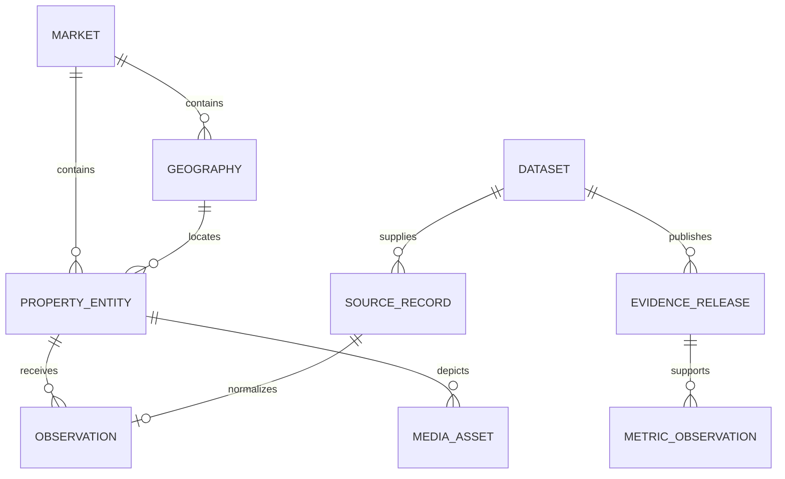
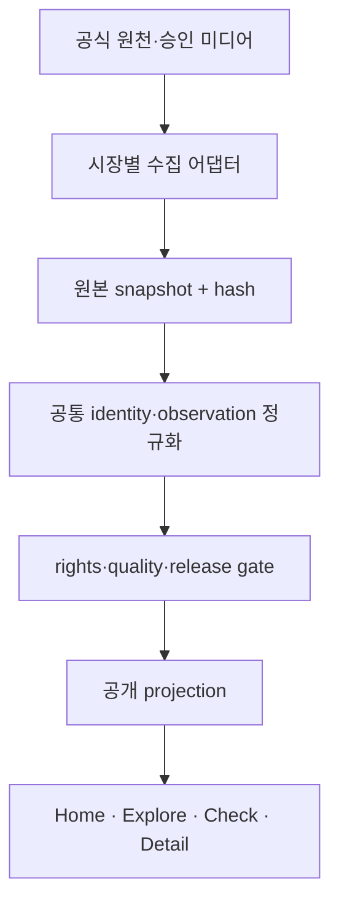

# SignedPrice 세 도시 경험·글로벌 부동산 데이터 모델 설계

**작성일:** 2026-09-04  
**상태:** 사용자 승인 완료
**적용 범위:** 글로벌 홈페이지, 시장 전환, 기능 연결, 건물 미디어, 공통 데이터 모델, 출시 순서  
**선행 승인:** 세 도시 중심 홈페이지, 실제 건물 사진 우선, Street View 보조화, 전 화면 UI 정돈  
**변경 관계:** `2026-09-04-signedprice-editorial-growth-ui-design.md`의 사업·타이포그래피·광고 원칙은 유지한다. 다만 해당 문서의 서울 중심 홈페이지 구성과 Building Detail 미디어 규칙은 이 문서로 교체한다.

## 1. 제품 정의

SignedPrice는 서울 데이터 사이트에 해외 도시를 추가한 서비스가 아니다. 제품의 공개 약속은 다음으로 고정한다.

> SignedPrice는 서울·싱가포르·두바이의 서로 다른 부동산 시장을 같은 의사결정 문법으로 탐색하되, 각 숫자의 출처·기간·권리·한계를 숨기지 않는 국제 부동산 의사결정 서비스다.

세 도시의 데이터 깊이는 현재 같지 않다. 화면을 억지로 대칭으로 만들지 않고, 사용자가 첫 화면에서 세 도시와 각 도시의 실제 지원 범위를 함께 이해하게 한다.

핵심 사용자 흐름은 다음과 같다.

사이트가 성장해도 이 흐름보다 앞에 매물 광고, 중개 문의, 투자 영업을 놓지 않는다. 광고 수익은 Guides와 Insights에서 만들고, 데이터 화면은 신뢰와 반복 사용을 만든다.

## 2. 조사 결과와 적용 원칙

### 2.1 글로벌 데이터 표준과 포털

- [RESO Data Dictionary 2.0](https://www.reso.org/data-dictionary/)은 부동산 데이터를 Resource, Field, Lookup, Relationship으로 나누고 지역 고유 필드의 확장을 허용한다. SignedPrice도 하나의 범용 테이블에 모든 현지 속성을 밀어 넣지 않고 공통 코어와 지역 확장을 분리한다.
- RESO는 Property와 Media 같은 리소스를 관계로 연결한다. 사진은 URL 문자열 하나가 아니라 별도 권리·출처·상태를 가진 자산으로 취급한다.
- [Rightmove의 등록 구조](https://customerfaq.rightmove.co.uk/support/solutions/articles/7000055096-how-to-make-changes-to-a-property-on-rightmove-that-i-have-uploaded)는 Basic Information, Details, Media를 분리하고 reference, address, price, bedrooms, property type, descriptions를 핵심 필드로 둔다. SignedPrice는 부동산 신원, 관측 가격, 설명, 미디어를 서로 덮어쓰지 않게 분리한다.
- [Zillow의 검색 가이드](https://www.zillow.com/learn/zillow-advanced-search/)는 개별 주택에서 가격 이력과 세금·평가 이력을 함께 제공한다고 설명한다. [비교 거래 가이드](https://www.zillow.com/learn/real-estate-comps/)는 위치, 기간, 면적, 침실·욕실, 연식, 상태, 주변 환경을 비교 조건으로 사용한다. SignedPrice의 Check는 단일 가격 수치가 아니라 비교 범위와 선택 이유를 저장해야 한다.
- [PropertyGuru 프로젝트 페이지](https://www.propertyguru.com.sg/property-for-sale/at-217d-sumang-walk-23258)는 유형, 준공연도, tenure, 블록·층수, 개발자, 교통 접근, 거래 이력을 한 프로젝트 신원 아래 연결한다. 싱가포르의 프로젝트·HDB 블록은 단순한 서울식 `building`으로 평면화하지 않는다.
- [Redfin Data Center](https://www.redfin.com/news/new-redfin-data-center/)는 지표 정의, 지역 범위, 주기, 계절조정 여부와 다운로드 가능한 데이터를 연결한다. SignedPrice의 파생 지표도 값만 저장하지 않고 산식·기간·표본·조정 여부를 함께 저장한다.

### 2.2 공식 시장 데이터

- 서울은 현재 사용 중인 국토교통부 실거래 원천의 매매·전세·월세 구분, 전용면적, 계약일, 층, 주택유형과 원천 레코드 식별자를 보존한다.
- [URA](https://www.ura.gov.sg/property-data/private-residential-properties/)는 싱가포르 민간 주택에서 거래, 임대 계약, 개발자 판매, 공급 파이프라인, 시계열을 별도 데이터군으로 제공한다. 따라서 판매와 임대, 민간 주택과 HDB를 한 지표로 합치지 않는다.
- [HDB resale 공식 데이터](https://data.gov.sg/datasets/d_8b84c4ee58e3cfc0ece0d773c8ca6abc/view)는 town, flat type, block, street, storey range, floor area, flat model, lease commencement, remaining lease, resale price를 제공한다. 이 속성은 싱가포르 공공주택 확장 모델의 기준이 된다.
- [Dubai Land Department 공개 구조](https://dubailand.gov.ae/en/open-data/real-estate-data/)는 Transactions, Rents, Project, Valuations, Land, Building, Unit, Broker, Developer를 별도 데이터군으로 둔다. 거래에는 freehold, registration type, property type/subtype, transaction/property size, rooms, master project, project가 있고, 프로젝트에는 개발자, 상태, 진척률, 완료일, 총 건물·유닛 등이 있다. Dubai를 단순 지역 평균 가격 테이블로 시작하지 않는다.

### 2.3 미디어 권리

- [Google Places Photo 정책](https://developers.google.com/maps/documentation/places/web-service/place-photos)은 사진 저자 attribution을 요구할 수 있고 photo resource name의 캐싱을 금지한다. place ID만 영구 식별자로 저장하고 사진은 요청 시 조회한다.
- [Google Places 정책](https://developers.google.com/maps/documentation/places/web-service/policies)은 Places 콘텐츠의 사전 수집·저장 제한과 Google Maps·저자 표시 요구를 명시한다. Google 사진을 SignedPrice 소유 이미지처럼 Vercel 저장소에 복제하지 않는다.
- 소유 또는 별도 라이선스가 확보된 이미지만 Vercel Blob 같은 객체 저장소로 복사할 수 있다. 연결된 Postgres에는 이미지 바이너리가 아니라 정체성, 권리, 출처, 검수, 표시 상태를 저장한다.

## 3. 검토한 데이터 모델 접근

| 접근 | 장점 | 문제 | 판단 |
| --- | --- | --- | --- |
| 하나의 범용 JSON 문서 | 새 도시와 필드를 빨리 추가할 수 있음 | 검색 인덱스, 타입, 관계, 중복 판정, 지표 재현성이 약함 | 사용하지 않음 |
| 도시별 독립 스키마 | 각 공식 원천을 가장 빠르게 옮길 수 있음 | 글로벌 탐색·비교·미디어·콘텐츠 연결을 매번 새로 구현해야 함 | 원천 어댑터에만 사용 |
| **공통 코어 + 시장별 검증 확장** | 공통 UX와 시장 고유성을 동시에 유지 | 초기 매핑과 버전 관리가 필요 | **채택** |

채택 모델은 공통 질문에 답하는 필드는 정규화한다. 현지에서만 의미 있는 필드는 `namespace + schema_version`을 가진 확장 payload로 보존하되, 공개 필터에 필요한 값은 타입이 있는 공통 열로 승격한다.

## 4. 글로벌 홈페이지와 시장 경험

### 4.1 첫 화면

첫 화면은 세 도시 선택기다. `Seoul / Singapore / Dubai` 세 탭은 스크롤 없이 항상 보이며 선택 상태와 함께 다음 다섯 항목이 원자적으로 바뀐다.

1. 도시 대표 사진
2. 도시명과 한 문장 설명
3. 현재 공개 가능한 대표 근거
4. 데이터 기간·상태
5. 그 상태에서 실제로 수행 가능한 CTA

헤드라인은 특정 도시가 아니라 글로벌 약속을 말한다.

> Compare property evidence across Seoul, Singapore and Dubai.

자동 전환은 7초 간격으로 제한한다. 포인터 hover, 키보드 focus, 탭 클릭, 스와이프가 발생하면 해당 세션에서는 자동 전환을 멈춘다. `prefers-reduced-motion` 사용자는 자동 전환과 전환 애니메이션을 받지 않는다. 전환 효과는 250ms 이하의 단순 opacity 변화만 허용한다.

세 도시의 수치를 한 줄에서 순위처럼 비교하지 않는다. 선택된 도시의 현지 통화·현지 주거 부문·현지 기간을 유지한다.

### 4.2 도시별 행동

| 도시 | 1차 행동 | 2차 행동 | 홈에서 보여줄 상태 |
| --- | --- | --- | --- |
| Seoul | Explore Seoul | Check a price | 매매·전세·월세 근거 범위 |
| Singapore | Explore Singapore | Check a price | 민간·HDB 중 공개 가능한 부문과 기간 |
| Dubai | Explore market overview | Read Dubai research | 거래 상세 권리 확인 전까지 시장·프로젝트 맥락 |

Dubai에 실제로 지원하지 않는 Check나 건물 거래 상세 CTA를 보여주지 않는다. 반대로 준비 중이라는 이유로 도시 자체를 숨기지도 않는다.

### 4.3 지속되는 시장 맥락

- 헤더 시장 전환기는 언어 전환기와 분리한다.
- 시장 진입 후 현재 도시와 지원 기능을 표시한다.
- Explore의 필터, 지도 위치, 선택 엔터티는 URL에 남긴다.
- 상세에서 뒤로 가면 Explore 상태가 복원된다.
- 상세의 `Check this property`는 시장과 엔터티 ID를 전달한다.
- Check 결과의 비교 사례는 다시 상세 또는 Explore 선택 상태로 연결된다.
- Insights와 Guides는 관련 도시·지역·프로젝트 링크를 명시적으로 가진다.

## 5. 공통 데이터 아키텍처

### 5.1 계층

데이터는 다섯 계층으로 나눈다.

1. **Identity:** 시장, 지역, 부동산 실체와 외부 식별자
2. **Observation:** 거래, 임대계약, 평가, 매물 가격처럼 시점이 있는 관측
3. **Evidence:** 원천, 수집 실행, 권리 정책, 공개 snapshot과 방법론
4. **Presentation:** 파생 지표, 시장 capability, 대표 미디어와 콘텐츠 연결
5. **Future service:** 매물, 관심, 검증 요청, 중개 파트너. 지금은 인터페이스만 예약하고 구현하지 않는다.

### 5.2 시장과 지역

#### `markets`

| 필드 | 목적 |
| --- | --- |
| `id` | `kr-seoul`, `sg-singapore`, `ae-dubai` 같은 안정 ID |
| `country_code`, `city_slug`, `display_name` | URL과 표시 정체성 |
| `currency_code`, `timezone` | 통화·날짜 계산 기준 |
| `default_locale` | 기본 편집 언어 |
| `status` | active, research-only, planned |

#### `geographies`

`districts` 한 단계만 강제하지 않고 self-referencing 계층을 사용한다.

| 필드 | 목적 |
| --- | --- |
| `id`, `market_id`, `parent_id` | 시장 안의 지역 계층 |
| `kind` | city, region, district, planning-area, town, neighborhood, community |
| `official_name`, `localized_names` | 공식명과 EN/KO/ZH 표시명 |
| `provider_code` | 법정동 코드, postal district, DLD area code 등 |
| `centroid`, `boundary` | 지도·공간 검색. boundary는 권리가 허용될 때만 저장 |

서울 구·동, 싱가포르 CCR/RCR/OCR·postal district·town, Dubai area/community를 같은 깊이로 강제하지 않는다.

### 5.3 부동산 실체

#### `property_entities`

프로젝트와 건물을 억지로 하나의 `building`으로 부르지 않는다.

| 필드 | 목적 |
| --- | --- |
| `id`, `market_id`, `geography_id`, `parent_id` | 안정 ID와 계층 |
| `kind` | master-development, project, estate, building, block, unit, land-parcel |
| `canonical_name`, `normalized_name` | 공개명과 일치 비교 |
| `address_text`, `postal_code`, `latitude`, `longitude` | 위치 |
| `housing_sector`, `property_class` | public/private 부문과 apartment, officetel, flat, condominium, villa, landed 등 정규화 분류 |
| `completion_date`, `completion_precision` | 일·월·연 단위 출처 정밀도 보존 |
| `identity_status` | unverified, verified, ambiguous, rejected |
| `local_attributes`, `local_schema_version` | 검증된 시장별 확장 payload |

`property_entities`의 parent-child 예시는 다음과 같다.

- Seoul: apartment complex → building/block
- Singapore private: project → block/tower
- Singapore HDB: estate/town → block
- Dubai: master development → project → building/tower → unit

#### `entity_aliases`와 `external_identifiers`

- 원천별 공식명, 번역명, 약칭을 별도 alias로 저장한다.
- `source_id + external_type + external_value`를 고유키로 둔다.
- 자동 매칭 결과에는 confidence와 matching method를 저장한다.
- 공개 사진이나 거래는 identity가 verified인 엔터티에만 연결한다.

### 5.4 관측 데이터

기존 `transactions`의 `price_krw`와 한국 계약유형 제약은 글로벌 모델로 직접 확장하지 않는다. 새 `observations` 코어를 만들고 기존 데이터는 어댑터를 거쳐 이 모델에 투영한다.

| 필드 | 목적 |
| --- | --- |
| `id`, `market_id`, `subject_entity_id`, `source_record_id` | 시장·실체·원천 연결 |
| `kind` | sale, rent, valuation, mortgage, gift, listing-ask |
| `stage` | new-sale, resale, sub-sale, off-plan, ready, renewal 등 |
| `observed_at`, `registered_at`, `period_start`, `period_end` | 계약·등록·기간 구분 |
| `amount_minor`, `annual_amount_minor`, `currency_code` | 통화별 최소단위 정수 금액 |
| `deposit_minor`, `recurring_amount_minor`, `frequency` | 전세·월세·주기 임대 지원 |
| `property_area_sqm`, `transacted_area_sqm`, `area_basis` | 전용·연면적·거래면적 혼동 방지 |
| `floor_value`, `floor_range`, `bedrooms`, `rooms` | 비교 조건. 원천이 제공할 때만 |
| `tenure_kind`, `tenure_start`, `tenure_end` | freehold·leasehold와 잔여기간 계산 |
| `status` | active, cancelled, corrected, superseded |
| `local_attributes`, `local_schema_version` | 원천 고유 필드 보존 |

환율로 변환된 가격은 원 거래를 덮어쓰지 않는다. 비교 화면에서만 별도 `exchange_rate_observations`의 기준일·출처와 함께 계산한다.

### 5.5 원천과 공개 근거

#### `datasets`

| 필드 | 목적 |
| --- | --- |
| `id`, `provider`, `official_name`, `landing_url` | 데이터군 정체성 |
| `market_id`, `subject_scope` | 시장과 sale/rent/project 등 범위 |
| `refresh_cadence`, `expected_lag` | 갱신 기대치 |
| `schema_version`, `parser_version` | 변경 탐지 |
| `rights_policy_id` | fetch/store/cache/display/commercial/index 권리 |

#### `source_records`

- 원천 레코드의 안정 business key와 content hash를 저장한다.
- 큰 원본 payload는 객체 저장소 snapshot으로 두고 Postgres에는 object reference와 hash만 저장한다.
- 작은 행은 제한된 JSONB로 보존할 수 있지만 공개 API에서 직접 반환하지 않는다.
- 수정·취소 레코드는 삭제하지 않고 앞선 버전을 supersede한다.

#### `evidence_releases`

현재 SignedPrice의 snapshot·hash·rights fail-closed 원칙을 그대로 일반화한다.

| 필드 | 목적 |
| --- | --- |
| `id`, `dataset_id`, `market_id` | 공개 근거 identity |
| `period_start`, `period_end`, `generated_at` | 기준 기간 |
| `record_count`, `coverage`, `publication_minimum` | 범위·표본 |
| `methodology_id`, `schema_version`, `parser_version` | 재현성 |
| `rights_policy_id`, `display_state`, `index_state` | 공개·검색 권리 |
| `object_url`, `sha256` | 불변 snapshot |

public route는 ingestion table이나 raw record를 직접 읽지 않고, 승인된 `evidence_release` 또는 그로부터 생성된 공개 projection만 읽는다.

### 5.6 파생 지표

#### `metric_definitions`

- `median_sale_price`, `median_price_per_sqm`, `transaction_count`, `median_rent`, `yield`처럼 안정 ID를 사용한다.
- 산식 버전, 분모·분자, 포함·제외 조건, 계절조정 여부, 최소 표본을 저장한다.

#### `metric_observations`

| 필드 | 목적 |
| --- | --- |
| `metric_definition_id`, `subject_type`, `subject_id` | 지표와 대상 |
| `period_start`, `period_end` | 기간 |
| `value_numeric`, `unit`, `currency_code` | 값과 단위 |
| `sample_count`, `published` | 표본과 공개 여부 |
| `evidence_release_id` | 사용한 근거 |
| `calculation_hash` | 결과 재현·변경 탐지 |

서로 다른 주거 부문, 면적 기준, 통화, 기간을 가진 지표는 같은 랭킹 행에서 직접 비교하지 않는다.

### 5.7 시장 capability

홈과 내비게이션의 상태 문구를 하드코딩하지 않고 `market_capabilities` projection으로 만든다.

| 필드 | 예시 |
| --- | --- |
| `market_id` | `sg-singapore` |
| `feature` | explore, check, rankings, detail, research |
| `sector` | private-residential, HDB, all-residential |
| `state` | available, limited, insufficient, rights-blocked, unavailable |
| `evidence_release_id` | 기능을 지지하는 현재 release |
| `limitation` | 사용자에게 보여줄 구체적 제한 |
| `checked_at` | 상태 확인 시점 |

이 projection이 홈페이지 슬라이드의 근거·CTA, 시장 홈의 메뉴, 빈 상태를 함께 결정한다.

### 5.8 주변 환경과 콘텐츠 연결

기존 `nearby_places`는 canonical `property_entity`에 연결하고 원천, 거리 산식, 계산 시점과 좌표 정밀도를 보존한다. 역·학교·개발계획을 하나의 의미 없는 amenity 점수로 합치지 않는다.

`content_entity_links`는 article과 market, geography, property entity를 연결하며 link role을 `primary-subject`, `supporting-evidence`, `related-guide`로 구분한다. 이 관계가 Guides/Insights에서 Explore·Check·Detail로 가는 편집 링크를 만든다. 자동 이름 매칭 결과는 편집 승인 전 공개하지 않는다.

## 6. 실제 건물 사진 모델

기존 `building_photos`는 `media_assets`로 일반화하되 마이그레이션 동안 호환 view를 유지한다.

| 필드 | 목적 |
| --- | --- |
| `id`, `subject_entity_id`, `role`, `position` | 대상과 대표 순서 |
| `provider` | owned-object, licensed-url, google-place |
| `provider_reference`, `asset_url`, `source_page_url` | 원본 위치. provider 정책에 따라 상호 배타적 |
| `rights_status`, `license_code`, `rights_expires_at` | 표시·상업 사용 권리 |
| `attribution_name`, `attribution_url` | 출처 표시 |
| `width`, `height`, `content_hash`, `focal_x`, `focal_y` | 품질·중복·크롭 |
| `subject_kind` | exterior, entrance, aerial, amenity, floorplan, neighborhood |
| `review_status`, `visual_reviewed_at`, `approved_by` | candidate→review→approved 흐름 |
| `last_checked_at`, `broken_at` | 링크 상태 |

### 6.1 표시 우선순위

1. exact entity + approved + owned/licensed photo
2. exact entity + approved + provider-display photo
3. parent project/building의 승인된 대표 사진. 관계를 캡션에 표시
4. 도시 대표 편집 사진. 건물 사진이라고 주장하지 않음
5. 중립적인 위치 지도와 주소 패널

Street View는 위 fallback 목록의 대표 미디어가 아니다. `View street context`를 누른 뒤 열리는 보조 패널에만 두며, 건물 실체 사진이 아님을 표시한다.

### 6.2 수집 순서

- Tier A: 홈페이지용 서울·싱가포르·두바이 대표 사진 3장
- Tier B: 방문량이 높은 Seoul/Singapore 상세 엔터티 각 20개
- Tier C: 검색 유입과 상세 조회량에 따라 후보 큐를 확장
- Dubai 개별 프로젝트 사진은 프로젝트 identity와 권리가 확인된 뒤에만 등록

무차별 웹 크롤링과 검색 결과 이미지 복사는 금지한다. 공식 개발자·프로젝트 미디어도 사용 조건과 상업 이용 권한을 확인한 뒤 승인한다.

## 7. 상세 화면과 기능 연결

모든 시장 상세는 같은 섹션 순서를 사용한다. 데이터가 없는 섹션은 빈 카드로 남기지 않고 제거하거나 명확한 제한 상태를 보여준다.

1. 승인 사진 또는 중립 위치 패널
2. 이름·유형·주소·신원 상태
3. 현재 공개 가능한 대표 가격 근거
4. 거래/임대 이력
5. 비교 범위와 유사 사례
6. 건물·프로젝트 사실과 tenure
7. 교통·주변 환경
8. 출처·기간·수정 정책
9. Explore 복귀, Check, 관련 Guide

Seoul, Singapore private, HDB, Dubai project가 각기 다른 React 페이지 문법을 만들지 않고 공통 `PropertyDecisionDetail` view model에 투영된다. 시장 어댑터는 데이터의 의미를 번역하지만 UI 컴포넌트 안에서 시장별 조건문을 증식시키지 않는다.

## 8. UI 정돈 범위

이번 개편은 홈만 바꾸지 않는다. 아래 공개 화면을 하나의 여정으로 연속 검수한다.

| 화면 | 주요 검수 |
| --- | --- |
| Global header/home | 세 도시 노출, 탭·자동전환, CTA, 언어/시장 분리 |
| Market entry | 지원 기능 우선순위, 중복 설명 제거 |
| Explore | 필터·목록·지도·URL·선택 상태 연결 |
| Check | 입력 순서, 결과 우선, 비교 범위 설명 |
| Detail | 사진, 신원, 가격, 비교, 다음 행동 |
| Compare | capability와 시장 수치를 혼동하지 않음 |
| Insights/Guides | 도시·도구 연결, 읽기 폭, 광고 예약 영역 |
| Loading/empty/error | 실제 다음 행동과 원인, 과도한 패널 제거 |

기존 디자인-review 컴포넌트와 운영 컴포넌트가 중복된 상태를 종료한다. 승인된 토큰과 공통 화면 문법을 운영 컴포넌트로 승격한 뒤 review 전용 복제본을 제거한다.

## 9. 저장소와 데이터 흐름

- 연결된 Postgres: identity, 관계, 권리·검수 메타데이터, 공개 조회 projection
- 객체 저장소: 원본 snapshot, 소유/라이선스 이미지, 생성 artifact
- Google Places: place ID만 저장하고 허용된 방식으로 요청 시 표시
- 애플리케이션 코드: 시장별 원천 어댑터와 공통 view model
- 공개 route: 승인 media와 released evidence만 읽는 fail-closed 경계

## 10. 마이그레이션 전략

한 번에 현재 테이블을 교체하지 않는다.

### Phase A — 호환 코어

- `geographies`, `property_entities`, `external_identifiers`, `datasets`, `evidence_releases`, `market_capabilities`, `media_assets`를 추가한다.
- 기존 `markets`, `districts`, `buildings`, `building_photos`를 새 코어로 backfill한다.
- 기존 route는 유지한다.

### Phase B — 홈과 미디어

- 세 도시 capability view model과 홈 선택기를 연결한다.
- 승인 사진 우선 resolver를 공통화한다.
- Street View를 대표 미디어에서 제거한다.

### Phase C — 상세와 기능 연결

- Seoul building, Singapore project/HDB를 공통 detail model로 투영한다.
- Explore→Detail→Check 왕복 상태를 연결한다.
- 기존 결과와 새 projection을 dual-read로 비교한다.

### Phase D — 글로벌 observation

- 한국과 싱가포르 거래를 `observations`로 투영한다.
- 금액·면적·tenure·계약 기간 정규화를 검증한다.
- Dubai는 권리 정책과 원천 schema canary가 통과한 데이터군부터 추가한다.

### Phase E — 콘텐츠와 광고 준비

- article–market–geography–property 연결을 추가한다.
- Guides/Insights에서 관련 Explore·Check·Detail을 자동이 아닌 편집 승인 링크로 노출한다.
- Core Web Vitals, 정책 페이지, 광고 영역 CLS, 콘텐츠 품질을 검수한다.
- 이 단계가 끝난 뒤 AdSense를 신청한다.

미래 매물·중개용 `listings`, `organizations`, `agents`, `enquiries`는 RESO의 resource 분리를 참고해 별도 설계한다. AdSense 이전 범위에 빈 테이블과 가짜 UI를 미리 만들지 않는다.

## 11. 품질·오류·권리 규칙

- 원천 record와 canonical entity는 분리한다. 이름이 같다고 자동 병합하지 않는다.
- 통화는 ISO 4217 코드와 최소단위 정수로 저장한다.
- 면적은 원 단위와 canonical sqm, area basis를 함께 보존한다.
- 날짜는 contract, registration, publication, retrieval을 구분한다.
- 취소·정정 레코드는 조용히 삭제하지 않는다.
- rights policy가 fetch/store/display/commercial/index 중 하나라도 필요한 권한을 허용하지 않으면 해당 단계에서 닫는다.
- 파생 지표는 evidence release와 calculation hash 없이 공개하지 않는다.
- 사진은 identity, rights, attribution, visual review가 모두 통과해야 건물 대표 사진이 된다.
- DB 또는 외부 사진 제공자가 실패해도 페이지 전체를 실패시키지 않는다. 중립 위치 패널로 축소한다.
- 서울·싱가포르·두바이의 부문이 호환되지 않으면 숫자 대신 capability를 비교한다.

## 12. 검증과 수용 기준

### 12.1 제품·UX

- 1440px, 1024px, 390px에서 세 도시 이름이 첫 화면에 모두 보인다.
- 도시 변경 시 사진·근거·상태·CTA가 한 번에 바뀐다.
- 키보드, 터치, reduced motion에서 시장 선택기가 작동한다.
- 공개 상세의 첫 미디어에 Street View가 나타나지 않는다.
- Explore에서 상세로 이동하고 돌아왔을 때 필터와 선택 상태가 유지된다.
- Seoul과 Singapore 상세가 같은 정보 순서와 타이포그래피를 사용한다.

### 12.2 데이터

- 동일 provider external ID가 둘 이상의 canonical entity에 승인 연결되지 않는다.
- 모든 공개 observation은 dataset, source record, evidence release와 rights policy로 역추적된다.
- 모든 공개 metric은 기간, 단위, 표본, methodology, evidence release를 가진다.
- 현지 통화 원값은 환율 표시값 때문에 변경되지 않는다.
- 시장별 extension payload는 등록된 schema version을 통과한다.
- 미디어 resolver는 권리·신원·승인 상태가 불완전한 사진을 반환하지 않는다.

### 12.3 시각 품질

- 전체 화면군을 EN과 zh-CN에서 확인한다.
- 제목 자간, 본문 행간, 긴 금액·고유명사 줄바꿈, 이미지 크롭을 화면별로 검수한다.
- 모바일에서 표를 축소하지 않고 우선순위 정보로 재구성한다.
- 카드·배지·규칙선·설명 문구 중복을 경로별로 제거한다.
- 글로벌 레퍼런스의 색상·폰트·컴포넌트를 복제하지 않고, 차용한 상호작용 원칙만 dossier에 기록한다.

## 13. 로드맵 판단 기준

개선 항목은 다음 질문으로 우선순위를 정한다.

1. 세 도시라는 제품 약속을 더 빨리 이해하게 하는가?
2. 사용자가 콘텐츠에서 실제 근거와 도구로 이동하게 하는가?
3. 숫자와 사진의 출처·권리를 더 명확하게 하는가?
4. 다음 도시와 언어를 추가할 때 시장별 복제 코드를 줄이는가?
5. 광고를 추가해도 데이터 판단과 핵심 행동을 방해하지 않는가?

다섯 질문에 기여하지 않는 장식 기능, 빈 사업 메뉴, 데이터 없는 예고 화면은 AdSense 이전 로드맵에서 제외한다.
