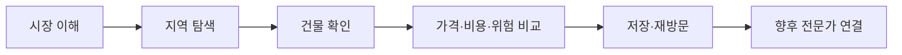

# SignedPrice 글로벌 부동산 투자 리서치·시각 시스템 설계

**작성일:** 2026-09-05  
**상태:** 사용자 방향 승인 완료, 문서 검토 대기  
**적용 범위:** 제품 포지셔닝, 공통 시각 시스템, 홈페이지, Markets, Explore, 건물 상세, News, Guides, 반응형·접근성·검수 기준  
**우선 시장:** Seoul, Singapore  
**후속 검증 시장:** Dubai, Japan, England & Wales

## 1. 결정 요약

SignedPrice는 해외 매물을 대량으로 나열하는 포털보다 먼저, 현지 사정을 모르는 글로벌 사용자가 주거용 부동산의 가격과 거래 근거를 이해하도록 돕는 투자 리서치 서비스로 성장한다.

초기 핵심 사용자는 영어로 서울·싱가포르의 주거용 부동산을 조사하는 개인 투자자와 실거주 겸 투자 검토자다. 영어를 기본 편집 언어로 사용하고 간체중문은 핵심 가이드와 검증된 분석부터 확장한다.

사이트의 중심 여정은 다음으로 고정한다.

현재 작업은 A–D의 신뢰성과 화면 일관성을 높이는 데 집중한다. 저장·알림·전문가 연결은 데이터 품질과 반복 사용이 확인된 뒤 별도 설계한다.

## 2. 기존 설계와의 관계

다음 원칙은 유지한다.

- `2026-09-04-signedprice-production-coherence-data-readiness-design.md`의 공통 헤더, 시장별 로컬 탭, 데이터 projection, 사진 권리·검증, 12px 하한, 44px 클릭 영역
- `2026-09-04-signedprice-data-newsroom-content-system-design.md`의 `Markets / Prices / News / Guides`, News 분류, 정책 생애주기, 수동 편집·검수, Explore·Check 연결
- `2026-09-04-signedprice-editorial-growth-ui-design.md`의 영어 중심 편집, 실제 데이터와 출처, 광고와 본문 분리

이 문서는 위 문서의 시각 표현 가운데 굵은 외곽선, 반복되는 파란 라벨·선·화살표, 과도한 대문자, 화면마다 다른 카드 구조를 교체한다. 제품 기능과 공개 URL은 유지한다.

Dubai 데이터 구축과 Dubai 전용 콘텐츠 제작은 이번 범위에서 제외한다. Japan과 England & Wales도 공개 메뉴에 추가하지 않고 원천 데이터의 상업적 이용 조건, 건물 연결률, 갱신 가능성을 샘플로 검증한 뒤 결정한다.

## 3. 확인한 현재 문제

2026-09-05 운영 화면과 현재 CSS를 함께 확인했다.

### 3.1 News

- 제목이 세 줄을 차지하고 첫 화면 높이를 지나치게 사용한다.
- 파란 대문자 kicker, 파란 링크, 화살표, 알약형 분류 탭이 가까이 모여 장치가 콘텐츠보다 먼저 보인다.
- 분류 탭과 시장 필터가 각각 한 줄을 차지하고 구분선이 반복된다.
- 대표 기사와 일반 기사 사이의 위계는 있으나 사진·인포그래픽 없이 큰 텍스트만 사용해 편집 화면이 메마르게 보인다.

### 3.2 건물 상세

- 페이지 바깥과 각 내부 영역에 굵은 선이 반복돼 하나의 문서보다 칸막이 표처럼 보인다.
- 사진 미확보 상태에 네이비 배경, 대문자 라벨, 이동된 테두리 문구를 사용해 실제 건물보다 장식이 먼저 보인다.
- 신원·수치·출처를 모두 격자 칸으로 표현해 중요도가 구분되지 않는다.
- 작은 대문자, 강한 굵기, 음수 자간이 자주 반복돼 긴 이름과 모바일 화면에서 읽기 어렵다.

### 3.3 사이트 전체

- 같은 정보라도 News 카드, 건물 카드, 시장 카드가 서로 다른 여백·선·라벨 규칙을 사용한다.
- 파란색이 링크, 상태, 장식, 구분선에 동시에 사용돼 의미가 약해졌다.
- 화면을 채우기 위한 설명과 UI 표식이 많아 실제 사진·제목·가격·기간·출처의 우선순위가 흐려진다.

## 4. 참고 사이트에서 채택할 원칙

참고 사이트의 브랜드 자산, 사진, 문구, 소스코드는 복제하지 않는다. 검증된 정보 순서와 상호작용 원칙만 SignedPrice의 데이터에 맞게 재구성한다.

| 참고 서비스 | 확인한 강점 | SignedPrice에 적용 | 가져오지 않는 것 |
| --- | --- | --- | --- |
| Savills Research | 연구 유형, 시장, 날짜, 제목, 요약의 명확한 순서 | News와 시장 리포트의 메타데이터·제목 위계 | 기업용 대형 메뉴, 반복 홍보 배너 |
| PropertyGuru Condo Directory | 사진과 지역·프로젝트명·tenure·완공연도·가격을 한 단위로 제공 | Explore와 상세에서 건물 신원·사진·핵심 사실을 붙여 표시 | 광고 슬롯, 매물 수 경쟁, 호가를 실거래처럼 보이는 표현 |
| EdgeProp Market Trends | 과거 가격과 거래량, 유사 부동산 비교의 연결 | 상세에서 거래 추세와 비교 후보로 이동 | 근거가 부족한 자체 가치 점수 |
| Global Property Guide | 국가·시장 비교와 거래비용·세금·법률 맥락 | Markets에서 외국인이 먼저 확인할 비용·제약·데이터 범위 | 서로 다른 원천의 수익률을 단일 순위로 단정하는 방식 |

확인 출처:

- Savills Insight & Opinion: <https://www.savills.com/insight-and-opinion/>
- PropertyGuru Condo Directory: <https://www.propertyguru.com.sg/condo-directory>
- EdgeProp Market Trends: <https://www.edgeprop.sg/market-trends>
- Global Property Guide: <https://www.globalpropertyguide.com/>

The Modern House는 편집 중심 부동산 브랜드의 참고 후보로 남기지만 이번 점검에서는 보안 확인 화면으로 직접 시각 검수를 완료하지 못했다. 따라서 이번 구현의 구체적인 화면 기준으로 사용하지 않는다.

## 5. 시각 방향

시각 방향은 **차분한 국제 부동산 리서치 데스크**로 정한다. 실제 건물 사진, 시장 데이터, 편집 제목이 화면의 중심이며 인터페이스는 이를 정리하는 역할만 한다.

### 5.1 색상

- 기존 네이비·블루·화이트 계열 브랜드를 유지한다.
- 본문과 제목은 ink, 배경은 canvas·white, 구분은 neutral divider를 기본으로 한다.
- 파란색은 링크, 현재 선택, 핵심 행동처럼 사용자가 행동하거나 상태를 구분해야 할 때만 사용한다.
- 장식용 파란 선, 의미 없는 파란 도형, 반복되는 파란 대문자 라벨을 사용하지 않는다.
- 상태는 색만으로 전달하지 않고 텍스트와 형태를 함께 사용한다.

### 5.2 선·표면·카드

- 페이지 전체를 감싸는 2px 외곽선을 제거한다.
- 영역 구분은 여백을 우선하고 필요할 때 1px neutral divider를 한 번만 사용한다.
- 모든 설명을 카드로 만들지 않는다. 독립적으로 선택하거나 비교하는 항목만 카드가 된다.
- 일반 카드에는 그림자를 사용하지 않는다. 반경은 8px 또는 12px로 제한한다.
- 알약형은 필터·토글에만 사용하고 섹션 라벨과 일반 링크에는 사용하지 않는다.

### 5.3 타이포그래피

| 용도 | Desktop | Mobile | 행간 | 자간 |
| --- | ---: | ---: | ---: | ---: |
| 페이지 H1 | 48px | 36px | 1.08 | 영문 `-0.02em`, CJK `0` |
| H2 | 32px | 28px | 1.2 | 영문 `-0.01em`, CJK `0` |
| H3·카드 제목 | 21px | 20px | 1.3 | `0` |
| Lead | 19px | 18px | 1.55 | `0` |
| 본문 | 16–18px | 16–17px | 1.65–1.75 | `0` |
| UI·필터 | 14px 이상 | 14px 이상 | 1.45 | `0` |
| Metadata | 12–13px | 12–13px | 1.5 | 최대 `0.02em` |

- 제목은 모바일에서 세 줄을 넘지 않도록 폭과 문구를 함께 조정한다.
- 대문자 표기는 1–3단어의 분류명에만 제한하고 자간을 과하게 벌리지 않는다.
- Regular, Medium, Semibold 세 굵기를 기본으로 하며 모든 메타데이터를 굵게 표시하지 않는다.
- 영문·한국어·중문에서 같은 역할의 글자는 같은 시각 단계에 놓는다.

### 5.4 간격과 그리드

- 일반 콘텐츠 최대 폭은 1200px, 데이터 작업 화면은 1440px까지 허용한다.
- Desktop 12열·40px 여백·24px gutter, Tablet 8열·24px 여백, Mobile 4열·16px 여백을 사용한다.
- 주요 섹션 간격은 Desktop 72–88px, Mobile 48–56px다.
- 컴포넌트 내부 간격은 8, 12, 16, 24, 32px 중심으로 제한한다.

## 6. 공통 컴포넌트 계약

화면마다 새 스타일을 만들지 않고 다음 공통 구성으로 수렴한다.

| 구성 | 공통 내용 | 화면별 차이 |
| --- | --- | --- |
| `PageIntro` | 제목, 한 문장 설명, 선택적 주 행동 | Markets·News·Guides의 문구 |
| `FilterBar` | 주 분류, 보조 시장 필터, 현재 상태 | Explore는 더 많은 입력 허용 |
| `MediaFrame` | 16:9, source·caption, focal point | 건물은 exact subject, News는 승인 infographic 허용 |
| `IdentityBlock` | 이름, 위치, 유형, 기간·상태 | 건물·시장·기사별 필드 |
| `EvidenceSummary` | 값, 단위, 기간, 표본, 출처 | 시장·건물 데이터의 실제 지원 범위 |
| `EditorialRow` | 유형, 시장, 날짜, 제목, 요약 | 이미지가 있을 때만 4:3 thumbnail 추가 |
| `SourceNote` | 근거 가까이에 출처·갱신일 | 정책에는 발표·시행·변경일 추가 |

각 공통 구성은 의미와 데이터 계약을 공유하되 모든 화면이 같은 카드 모양을 사용하지 않는다.

## 7. 페이지별 설계

### 7.1 홈페이지

첫 화면은 시장을 고르고 바로 탐색을 시작하는 데 집중한다.

1. 짧은 가치 제안과 Seoul·Singapore 선택
2. 선택 시장의 확인 가능한 핵심 지표와 갱신일
3. `Explore prices` 주 행동과 관련 시장 안내

본문은 다음 세 구역을 둔다.

- 최신 시장 분석·정책 변화
- 해외 구매자가 처음 확인할 가이드
- 서울·싱가포르 시장 비교 진입

도시별 이름, CTA 문구 구조, 카드 높이, 사진 비율을 동일하게 맞춘다. 공개 데이터가 없는 Dubai는 첫 화면의 동등한 활성 시장으로 노출하지 않는다.

### 7.2 Markets

시장 소개, 외국인에게 적용되는 소유·거래 조건, 비용, 데이터 범위, 지역 탐색을 한 흐름으로 배치한다.

- 첫 화면: 시장명, 한 문장 설명, 대표 사진, 데이터 갱신일, Explore 진입
- 핵심 지표: 값·단위·기간·표본을 같은 줄 구조로 표시
- 투자 맥락: 취득·보유·매각 단계에서 확인할 항목
- 최신 변화: 관련 Policy·Market Brief 최대 3개
- 데이터 범위: 제공 가능한 기능과 알려진 누락

서로 다른 시장의 지표를 직접 비교할 때는 통화, 기간, 부동산 유형, 호가·실거래 여부를 맞춘 경우에만 같은 차트에 둔다.

### 7.3 Explore

기존 Split/List/Table/Map 흐름을 유지하고 건물 마커와 상세 연결을 완성한다.

- 지역 선택 후 검증 좌표가 있는 건물 핀 표시
- 목록 선택과 핀 선택의 양방향 강조
- 선택 건물의 실제 사진·이름·주소·최근 근거를 요약 패널에 표시
- 상세에서 돌아오면 필터, 지도 중심, 선택 건물 복원
- 거래 없음, 거래 미수집, 위치 미검증, 사진 미확보를 서로 다른 상태로 표시

Explore에서 투자 점수나 예상 수익률을 새로 만들지 않는다. 관련 데이터가 확보되면 별도 설계한다.

### 7.4 건물 상세

Desktop 첫 화면은 12열 기준으로 사진 7열, 신원·핵심 사실 5열을 사용한다. Mobile은 사진 다음에 신원 정보를 쌓는다.

1. 실제 건물 사진과 출처
2. 건물명, 주소, 유형, 준공·tenure 등 신원 정보
3. 최근 거래 근거와 기간·표본
4. 가격 추세와 면적별 거래
5. 임대 근거가 있을 때 임대 데이터
6. 위치·주변 정보
7. 비교·Check·Explore 복귀
8. 출처와 데이터 한계

사진은 `exact_subject`와 공개 승인을 통과한 자산만 건물 대표 사진으로 사용한다. 승인된 provider reference는 동일한 exact subject 규칙으로 렌더링한다.

사진이 없을 때는 동일한 16:9 영역에 중립 배경과 `Building photo unavailable` 문구, 사진 상태 설명만 표시한다. 도시 사진, 다른 건물 사진, 장식용 파란 선·상자·떠 있는 단어를 사용하지 않는다.

핵심 사실은 모든 항목을 격자 카드로 만들지 않고 2열 definition list로 정리한다. 거래 수치와 출처는 본문 흐름에서 필요한 위치에 표시한다.

### 7.5 News

현재 큰 newsroom hero를 간결한 `News` 제목과 한 문장 설명으로 축소한다.

- Desktop H1은 최대 48px, intro 영역은 220px 이내를 기준으로 한다.
- `Latest / Policy / Market / Data Stories`는 밑줄형 주 탭으로 표시한다.
- `All / Seoul / Singapore`는 같은 filter bar 안의 보조 선택으로 둔다.
- 대표 기사는 승인 사진이나 infographic이 있을 때 5:7 미디어·본문 구성을 사용한다.
- 미디어가 없으면 텍스트가 전체 폭을 사용하며 빈 이미지 칸을 만들지 않는다.
- 나머지는 `type · market · date / headline / summary` 순서의 행 목록으로 표시한다.
- 화살표는 링크마다 반복하지 않고 필요한 주요 행동에만 사용한다.

기사 본문은 680–720px 읽기 폭을 유지하고 차트·정책 비교표만 최대 1120px까지 넓힌다. 출처는 관련 주장 가까이에 배치한다.

### 7.6 Guides

가이드는 외국인이 실제 순서를 이해하도록 `Who this is for / Direct answer / Steps / Costs or documents / Current policy / Sources` 구조를 사용한다.

목록은 사진이 확보된 글만 이미지 카드를 사용한다. 나머지는 제목과 요약 중심의 편집 행으로 제공한다. News와 같은 타이포·여백·메타데이터 규칙을 공유한다.

## 8. 콘텐츠와 투자 정보 원칙

초기 콘텐츠는 다음 네 축으로 운영한다.

| 축 | 주요 형식 | 사이트 연결 |
| --- | --- | --- |
| 시장 입문 | 외국인 구매·임차 절차, 현지 용어 | Markets, Guides |
| 데이터 분석 | 가격·거래량·임대료와 분포 | News Data Stories, Explore |
| 정책 변화 | 발표·시행·변경·종료 추적 | Policy Tracker, Guides |
| 지역·건물 리서치 | 실제 사진, 거래 근거, 비교 | Explore, Detail, Check |

인포그래픽은 가격 추이, 거래량, 비용 구성, 정책 타임라인, 건물 비교의 다섯 템플릿을 사용한다. 모든 그래픽에 기간, 단위, 시장, 출처, 갱신일을 포함한다.

수익률·총비용 계산을 공개할 때는 매입가, 거래비용, 환율, 공실, 관리비, 세금, 매각비용 중 포함·제외 항목을 함께 표시한다. 데이터가 부족한 건물에는 추정 수익률이나 투자 점수를 표시하지 않는다.

## 9. 데이터 상태와 오류 표현

화면은 최소 다음 상태를 구분한다.

| 상태 | 공개 표현 |
| --- | --- |
| 데이터 있음 | 기간·표본·출처와 값 표시 |
| 데이터 없음 | 해당 범위에서 관측 없음 |
| 아직 미수집 | 수집 범위 밖 또는 준비 중 |
| 조회 실패 | 잠시 불러오지 못함, 재시도 가능 |
| 위치 미검증 | 지도 핀 제외, 주소·신원은 유지 가능 |
| 사진 미확보 | 실제 사진 미확보 상태 표시 |
| 권리·검수 대기 | 공개 사진으로 사용하지 않음 |

한 데이터 요청 실패가 전체 페이지를 막지 않게 사진, 위치, 거래, 콘텐츠를 독립적으로 렌더링한다. 오류 문구는 원인을 모를 때 좌표·권리·네트워크 중 하나로 단정하지 않는다.

## 10. 반응형·접근성 기준

- 1440px, 1024px, 390px을 기본 검수 폭으로 사용한다.
- 모든 주요 버튼·탭·필터의 클릭 영역은 최소 44×44px이다.
- 200% 글자 확대에서 겹침, 잘림, 가로 스크롤이 없어야 한다.
- 키보드 focus가 보이고 탭·선택 상태에 적절한 ARIA 상태를 제공한다.
- 이미지에는 subject를 설명하는 alt를 제공하며 장식 이미지는 만들지 않는다.
- 차트는 핵심 값을 텍스트나 표로도 제공한다.
- 모바일 건물 상세에서 사진, 이름, 핵심 가격 근거가 첫 두 화면 안에 나타나야 한다.

## 11. 구현 순서와 출시 기준

### Phase 1. 공통 시각 규칙

- 색상 역할, 타이포, 여백, 선, 카드, focus 토큰 정리
- 공통 `PageIntro`, `FilterBar`, `MediaFrame`, `IdentityBlock`, `EditorialRow` 확정
- 현재 공개 기능과 URL 보존

### Phase 2. 건물 상세·News 기준 화면

- 건물 상세에서 굵은 외곽선·장식형 사진 없음 상태 제거
- News hero·필터·대표 기사·목록 밀도 조정
- 두 화면을 Desktop·Tablet·Mobile에서 나란히 검수해 공통 규칙 보정

### Phase 3. 전체 화면 확장

- Homepage, Markets, Guides, 서울·싱가포르 Explore 순으로 적용
- 도시별 CTA·사진 비율·상태 문구 일관성 확인
- 기능별 회귀와 페이지 간 이동 검증

### Phase 4. 투자 리서치 콘텐츠

- 정책 Tracker와 인포그래픽 템플릿 보완
- 시장 입문·데이터 분석·정책·건물 리서치의 초기 영문 묶음 발행
- 콘텐츠에서 Markets·Explore·Detail·Check 연결

운영 반영 전 다음이 모두 충족돼야 한다.

1. 타입 검사, lint, 관련 단위·통합 테스트와 production build 통과
2. 1440px·1024px·390px 주요 화면 시각 검수
3. 실제 사진과 사진 없음 상태 모두 검수
4. News 필터, Explore 선택, 상세 진입·복귀의 상호작용 검수
5. 서울·싱가포르의 같은 역할 화면이 같은 헤더·타이포·간격 규칙 사용
6. 12px 미만 공개 텍스트와 44px 미만 주요 클릭 영역 제거
7. 파란색 사용처가 링크·선택·주 행동으로 설명 가능

## 12. 후속 시장 선택 기준

Dubai, Japan, England & Wales는 다음 네 항목을 작은 샘플로 검증한 뒤 진입 순서를 정한다.

1. 상업적으로 재사용 가능한 원천 데이터인가
2. 거래를 지역 또는 개별 건물에 어느 수준까지 연결할 수 있는가
3. 정기 갱신을 자동화하고 실패를 감지할 수 있는가
4. 실제 건물 사진을 합법적으로 확보·검수할 수 있는가

시장 통계만 가능한 경우 Markets·News 수준으로 시작하고, 건물 연결이 확인될 때만 Explore·Detail을 공개한다.

## 13. 성공 지표

초기에는 콘텐츠 개수나 도시 개수보다 다음 행동을 본다.

- Markets에서 Explore 진입률
- News·Guides에서 관련 시장·건물로 이동한 비율
- Explore에서 건물 상세를 연 비율
- 상세에서 비교·Check·Explore 복귀를 사용한 비율
- 검색 방문자의 재방문과 이메일 구독
- 사진·거래·위치 상태가 정확하게 표시된 건물 비율

광고, 유료 리포트, 전문가 연결은 위 행동과 반복 사용이 확인된 뒤 별도 수익화 설계에서 다룬다.
